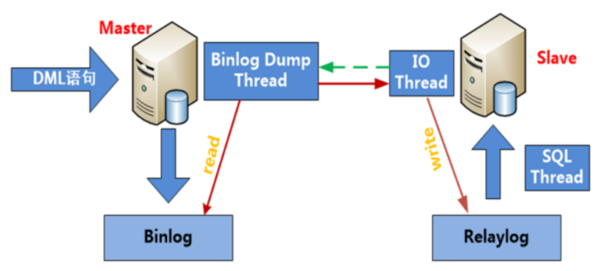
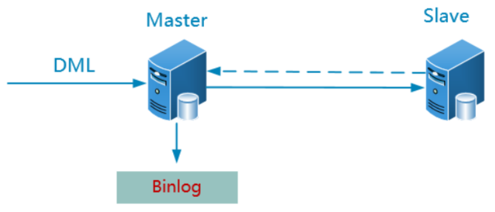
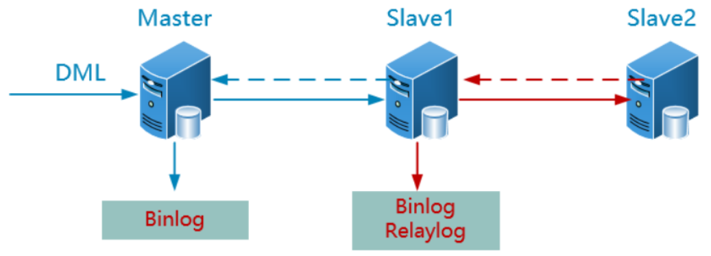
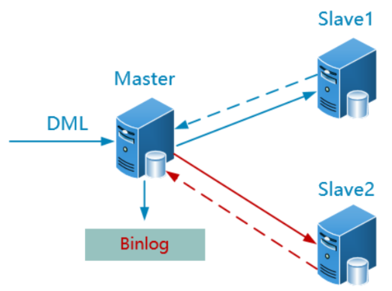
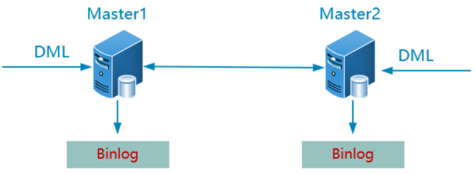
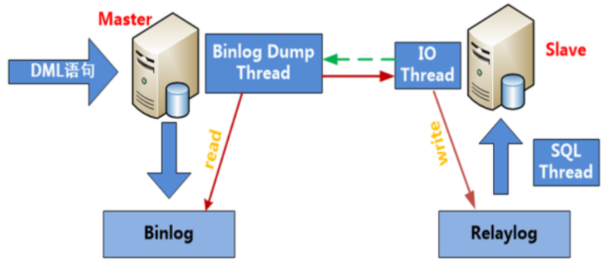
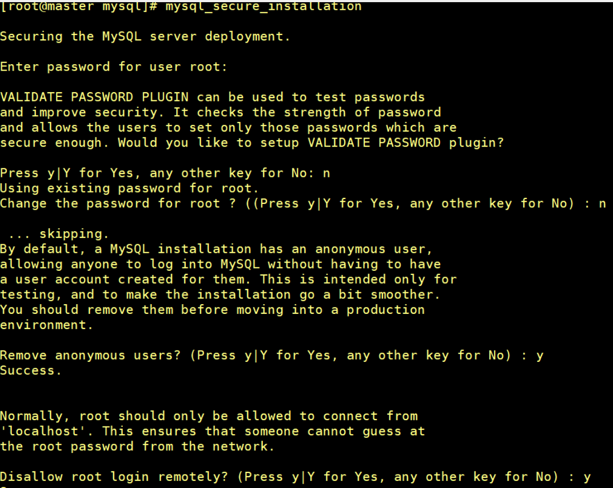
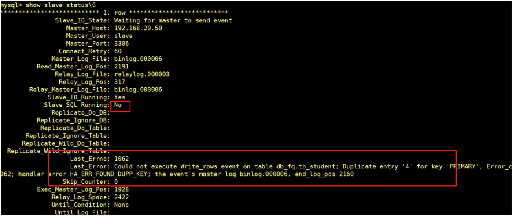

# MySQL主从复制架构

# 一、任务背景

## 1、真实案例

某同学刚入职公司，在熟悉公司业务环境的时候，发现他们的数据库架构是一主两从，但是两台从数据库和主库不同步。询问得知，已经好几个月不同步了，但是每天会全库备份主服务器上的数据到从服务器上，由于数据量不是很大，所以一直没有人处理主从不同步的问题。这次正好问到了，于是乎就安排该同学处理一下这个主从不同步的问题。

## 2、案例背后的核心技术

①熟悉MySQL数据库常见的主从架构

②理解MySQL主从架构的实现原理

③掌握MySQL主从架构的搭建

## 3、任务场景

随着业务量不断增长，公司对数据的安全性越来越重视，由于常规的备份不能够实时记录下数据库的所有状态，为了能够保障数据库的实时备份冗余，希望将现有单机数据库变成双机热备。

①任务要求

备份数据库

搭建双机热备数据库架构M-S

②任务目标

了解什么是MySQL的Replication

**理解MySQL的Replication的架构原理**

==**掌握MySQL的基本复制架构的搭建（M-S重点**==）

了解和掌握基于GTIDs的复制特点及搭建

# 二、MySQL集群概述

## 1、集群的主要类型

高可用集群（High Available Cluster，HA Cluster）

高可用集群是指通过特殊的软件把独立的服务器连接起来，组成一个能够提供故障切换功能的集群

## 2、如何衡量高可用

| 可用性级别(指标) | 年度宕机时间 | 描述         | 叫法 |
| ---------------- | ------------ | ------------ | ---- |
| 99%              | 3.65天/年    | 基本可用系统 | 2个9 |
| 99.9%            | 8.76小时/年  | 可用系统     | 3个9 |
| 99.99%           | 52.6分钟/年  | 高可用系统   | 4个9 |
| 99.999%          | 5.3分钟/年   | 抗故障系统   | 5个9 |
| 99.9999%         | 32秒/年      | 容错系统     | 6个9 |

计算方法：

```powershell
1年 = 365天 = 8760小时
99% = 8760 * 1% = 8760 * 0.01 = 87.6小时=3.65天
99.9 = 8760 * 0.1% = 8760 * 0.001 = 8.76小时
99.99 = 8760 * 0.0001 = 0.876小时 = 0.876 * 60 = 52.6分钟
99.999 = 8760 * 0.00001 = 0.0876小时 = 0.0876 * 60 = 5.26分钟
```

## 3、常用的集群架构

- ==**MySQL Replication **==      主从架构
- MySQL Cluster     集群架构
- MySQL Group Replication （MGR）     多主一从
- MariaDB Galera Cluster 
- ==MHA==|Keepalived|HeartBeat|Lvs，HAproxy等技术构建高可用集群

# 三、MySQL复制

## 1、什么是MySQL复制

Replication可以实现将数据从一台数据库服务器（master）复制到一台到多台数据库服务器(slave)

默认情况下，属于异步复制，所以无需维持长连接

## 2、MySQL复制原理

简单来说，master将数据库的改变写入二进制日志，slave同步这些二进制日志，并根据这些二进制日志进行数据重演操作，实现数据异步同步。

master：主

slave：从



**详细描述：**

当主从同步配置完毕后：

1. slave端的IO线程发送请求给master端的binlog dump线程
2. master端binlog dump线程==获取二进制日志==信息(==文件名和位置信息==)发送给slave端的IO线程
3. salve端IO线程获取到的内容==依次==写到slave端relay log(中继日志)里，并把master端的bin-log文件名和位置记录到master.info里
4. salve端的SQL线程，检测到relay  log中内容更新，就会解析relay log里更新的内容，并==执行这些操作==，从而达到和master数据一致


> relay log中继日志

作用：记录从（slave）服务器接收来自主（master）服务器的二进制日志

场景：用于主从复制

master主服务器将自己的二进制日志发送给slave从服务器，slave先保存在自己的==中继日志中==，然后再执行自己本地的relay log里的sql达到数据库更改和master保持一致。

如何开启？

默认中继日志没有开启，可以通过修改配置文件完成开启。

```powershell
# vim my.cnf
[mysqld]

#指定二进制日志存放位置及文件名
relay-log=/mysql_3306/data/relaylog
```

## 3、MySQL复制架构

### ①双机热备（AB复制）



默认情况下，master接收读写请求，slave只接收读请求以减轻master的压力

### ②级联复制



优点：进一步分担读压力

缺点：slave 1出现故障，后面的所有级联slave服务器都会同步失败

### ③并联复制（一主多从）



优点：解决上面的slave1的单点故障，同时也分担读压力

缺点：间接增加master的压力

### ④双主复制



特点：

从名称上来看，两台master好像都能接受读、写 请求，但实际上，往往运作的过程中，同一时刻只有其中一台master会接收请求，另外一台只接收读请求。

# 四、MySQL主从复制的搭建（AB复制）

## 1、传统AB复制架构

说明：在配置MySQL主从架构时，必须保障数据库的版本高度一致，统一版本为5.7.31

## 2、环境规划

| 编号 | 主机名称 | 主机地址      | 角色信息       |
| ---- | -------- | ------------- | -------------- |
| 1    | master   | 192.168.10.56 | MASTER主服务器 |
| 2    | slave    | 192.168.10.57 | SLAVE从服务器  |

## 3、安装前准备工作

第一步：克隆两台全新的数据库服务器，MASTER/SLAVE

第二步：首先启动MASTER，然后启动SLAVE，更改主机名称

Master：

```powershell
#  hostnamectl set-hostname master
```

Slave:

```powershell
#hostnamectl set-hostname slave
```

第三步：更改静态IP地址，把Master和Slave配置与规划一致

Master

```powershell
#vim /etc/sysconfig/network-scripts/ifcfg-ens33
...
IPADDR=192.168.10.56
```

Slave

```powershell
#vim /etc/sysconfig/network-scripts/ifcfg-ens33
...
IPADDR=192.168.10.57
```

Master/Slave

```powershell
#systemctl stop NetworkManager
#systemctl disable NetworkManager
```

设置完成后，重启网络，然后使用shell或MX远程连接

第四步：由于两台机器处于集群架构，需要相互连接。绑定主机名称与IP地址到/etc/hosts

Master/Slave：

```powershell
# vim /etc/hosts
192.168.20.50 master.it.cn
192.168.20.60 slave.it.cn
```

第五步：关闭防火墙与SElinux

```powershell
#systemctl stop firewalld
#systemctl disable firewalld
#setenforce 0
#vim /etc/selinux/config
SELINUX=disable
```

第六步：配置yum源（建议使用腾讯源）

```powershell
# yum install wget -y
# mv /etc/yum.repos.d/CentOS-Base.repo /etc/yum.repos.d/CentOS-Base.repo.backup
# wget -O /etc/yum.repos.d/CentOS-Base.repo http://mirrors.cloud.tencent.com/repo/centos7_base.repo

# yum clean all
# yum makecache
```

第七步：时间同步

```powershell
1#ntpdate  182.92.12.11
```

## 4、MySQL主从复制核心思路



1. slave必须安装相同版本的mysql数据库软件
2. master端必须开启==二进制日志==；slave端必须开启==relay log日志==
3. master端和slave端的server-id号==不能一致==
4. slave端配置向master来同步数据
   - master端必须创建一个复制用户
   - 保证master和slave端==初始数据一致==
   - 配置主从复制（slave端）

## 5、MySQL主从复制的具体实践

### 第一步：上传MySQL软件包到Master与Slave

### 第二步：在Master端安装、初始化以及运行mysql软件

安装需求：

| 选项     | 值                    |
| -------- | --------------------- |
| 安装路径 | /usr/local/mysql      |
| 数据路径 | /usr/local/mysql/data |
| 端口号   | 3306                  |

#### ①安装MySQL软件

```powershell
# vim mysql.sh
#!/bin/bash
yum install libaio -y
tar -xf mysql-5.7.31-linux-glibc2.12-x86_64.tar.gz
rm -rf /usr/local/mysql
mv mysql-5.7.31-linux-glibc2.12-x86_64 /usr/local/mysql
useradd -r -s /sbin/nologin mysql
rm -rf /etc/my.cnf
cd /usr/local/mysql
mkdir mysql-files
chown mysql:mysql mysql-files
chmod 750 mysql-files
bin/mysqld --initialize --user=mysql --basedir=/usr/local/mysql &> /root/password.txt
bin/mysql_ssl_rsa_setup --datadir=/usr/local/mysql/data
cp support-files/mysql.server /etc/init.d/mysqld
service mysqld start
echo 'export PATH=$PATH:/usr/local/mysql/bin' >> /etc/profile
source /etc/profile

#source mysql.sh
```

> shell脚本其实就是命令的堆砌，把一堆Linux命令写在同一个文件中，一起执行

#### ②安全配置

```powershell
查看配置时的临时密码
cat /root/password.txt
#mysql_secure_installation
在确认密码后，前面两个输入N，后面一直输入Y即可
```



#### ③配置my.cnf（重点开启二进制日志）

```powershell
#cd /usr/local/mysql
#vim my.cnf
[mysqld]
basedir=/usr/local/mysql
datadir=/usr/local/mysql/data
socket=/tmp/mysql.sock
port=3306
log-error=/usr/local/mysql/data/master.err
log-bin=/usr/local/mysql/data/binlog             一定要开启二进制日志
server-id=10 
character_set_server=utf8mb4                     utf8mb4相当于utf8升级版

配置完成后，重启mysqld服务
#service mysqld restart
#chkconfig --add mysqld
#chkconfig mysqld on

```

第三步：在Slave从服务器端安装mysql软件（不需要初始化）

①安装MySQL软件

```powershell
# vim mysql.sh
#!/bin/bash
yum install libaio -y
tar -xf mysql-5.7.31-linux-glibc2.12-x86_64.tar.gz
rm -rf /usr/local/mysql
mv mysql-5.7.31-linux-glibc2.12-x86_64 /usr/local/mysql
useradd -r -s /sbin/nologin mysql
rm -rf /etc/my.cnf
cd /usr/local/mysql
mkdir mysql-files
chown mysql:mysql mysql-files
chmod 750 mysql-files
cp support-files/mysql.server /etc/init.d/mysqld
echo 'export PATH=$PATH:/usr/local/mysql/bin' >> /etc/profile
source /etc/profile

#source mysql.sh
```

> 相对于主服务器MySQL的安装与配置，从服务器端不需要进行初始化操作，因为其数据将来自于主服务器

②配置my.cnf文件

```powershell
#cd /usr/local/mysql
#vim my.cnf
[mysqld]
basedir=/usr/local/mysql
datadir=/usr/local/mysql/data
socket=/tmp/mysql.sock
port=3310
log-error=/usr/local/mysql/data/slave.err
relay-log=/usr/local/mysql/data/relaylog			
server-id=100
character_set_server=utf8mb4        
```

③把master主服务器的数据目录同步到slave从服务器

a.把Master服务器中的mysqld停止掉

```powershell
#service mysqld stop
```

b.把MASTER服务器中的/usr/local/mysql/data目录下的auto.cnf文件删除

```powershell
#rm -rf /usr/local/mysql/data/auto.cnf
```

> 每安装一个mysql软件，其data数据目录都会产生一个auto.cnf文件，里面是一个唯一性的编号，相当于我们每个人的身份证号码

c.把master服务器中的/usr/local/mysql中的data目录拷贝一份到slave从服务器的/usr/local/mysql目录

```powershell
#rsync -av /usr/local/mysql/data root@192.168.10.57:/usr/local/mysql
```

d.同步完成后，把主服务器与从服务器中的mysqld启动

```powershell
#service mysqld start
```

### 常见问题解决方案

⭐常见问题1：MySQL无法启动

```powershell
#service mysql start
Redirecting to /bin/systemctl start mysqld.service
Failed to start mysqld.service: Unit not found.
```

出现以上问题的原因在于/etc/init.d目录中没有Mysqld这个文件，换句话说就是cp mysql.servet脚本

```powershell
#cp /usr/local/mysql/support0files/mysql.server /etc/init.d/mysqld
记录：/etc/init.d目录中的文件叫什么名字，我们service的时候就应该使用什么名字
#service mysql start
```


常见问题2：MySQL没有安装在/usr/local/mysql目录中，service也无法启动

```powershell
#service mysqld start
无法启动的原因可能是你的MySQL并没有安装在/usr/local/mysql目录中，因为/etc/init.d/mysqld脚本中的basedir于datadir默认指向的都是/usr/local/mysql
```

所以如果我们更换了Mysql的安装位置，则必须更改/etc/init.d/mysqld脚本中basedir与datadir目录

```powershell
#vim /etc/init.d/mysqld
basedir=你的安装路径
datadir=你的安装路径/data
```


常见问题3：因为my.cn配置文件导致mysql无法启动

```powershell
#vim my.cnf
[mysqld]
basedir=/usr/local/mysql             =>安装路径
datadir=/usr/local/mysql/data		 =>数据目录
socket=/tmp/mysql.sock				 => GLIBC默认就是/tmp/mysql.sock
port=3310
log-error=/usr/local/mysql/data/slave.err   =>错误日志放在哪里
relay-log=/usr/local/mysql/data/relaylog			
server-id=100
character_set_server=utf8mb4    
```


启动时报错问题

```powershell
2024-01-15T06:18:55.566951Z mysqld_safe error: log-error set to '/usr/local/mysql/slave.err', however file don't exists. Create writable for user 'mysql'.

```

产生以上问题的主要原因在于mysql这个用户对/usr/local/mysql文件夹没有写入权限

```powershell
#ll -d /usr/local/mysql
drwxr-xr-x. 11 7161 31415 174 Jan 15 14:18 /usr/local/mysql
发现文件拥有者位置与所属组位置都是两个数字，正常应该是文件拥有者的名称与文件所属组的名称。但是由于GLIBC已经提前打包了，我们解压后，如果在我们系统中，找不到源文件对应的文件拥有者与所属组，则以两个数字代替文件拥有者与所属组的显示。
```

解决方案：

方案一：建议把错误日志，丢在数据目录中

```powershell
#vim my.cnf
...
log-error=/usr/local/mysql/data/slave.err 
```

方法二：直接更改/usr/local/mysql目录的权限

```powershell
#chown -R mysql.mysql /usr/local/mysql
```

#### ④配置MASTER-SLAVE主从同步

a.在MASTER主服务器中创建一个账户，专门用于实现数据同步

Mysql5.7及以下版本：

```powershell
mysql> grant replication slave on *.* to 'slave'@'192.168.10.%' identified by '123456';
```


MySQL新版本中：

```powershell
mysql> create user 'slave'@'192.168.20.%' identified by '123';
mysql> grant replication slave on *.* to 'slave'@'10.1.1.%';
mysql> flush privileges;
```

b.在MASTER中锁表，然后查看二进制文件的名称及位置

```powershell
mysql> flush tables with read lock;
mysql> show master status;

+---------------+----------+--------------+------------------+-------------------+
| File          | Position | Binlog_Do_DB | Binlog_Ignore_DB | Executed_Gtid_Set |
+---------------+----------+--------------+------------------+-------------------+
| binlog.000006 |      449 |              |                  |                   |
+---------------+----------+--------------+------------------+-------------------+
1 row in set (0.00 sec)

```


c.在SLVAE从服务器中，使用change master to 指定主服务器，并实现数据同步


```powershell
mysql > change master to master_host='192.168.20.50',master_user='slave',master_password='123',master_port=3306,master_log_file='binlog.000006',master_log_pos=449;
  
  
  MASTER_HOST=：主机的IP地址
  MASTER_USER=：主机的user账号
  MASTER_PASSWORD=：主机的user账号密码
  MASTER_PORT=主机MYSQL端口号
  MASTER_LOG_FILE=：二进制文件名称
  MASTER_LOG_POS=：二进制文件位置

  
  
```


> > 主从复制的change master to语句不知道怎么写或记不住怎么办 
> > 答：求帮助  mysql> help change master to;
>
> 
>
> CHANGE MASTER TO
>   MASTER_HOST='master2.example.com',
>   MASTER_USER='replication',
>   MASTER_PASSWORD='password',
>   MASTER_PORT=3306,
>   MASTER_LOG_FILE='master2-bin.001',
>   MASTER_LOG_POS=4,
>   MASTER_CONNECT_RETRY=10;
>
> 

d.启动slave数据同步

```powershell
mysql > start slave;
mysql > show slave status\G
```

常见问题解决方案

在配置主从时，一般遇到错误，大部分都是change master to语句写错了（80%），解决方案

```powershell
mysql > stop slave;
mysql > change master to master_host='192.168.20.50',master_user='slave',master_password='123',master_port=3306,master_log_file='binlog.000006',master_log_pos=449;

mysql > start slave;
mysql > show slave status\G
```

⑤主MASTER服务解锁

```powershell
mysql > unlock tables;
```

6、SLAVE从服务器不小心写入数据解决方案

正常情况下：

MASTER既可以读，也可以写。但是SLAVE从服务器，只能执行读取操作。一旦我们在SLQVE从服务器种写入数据，则主从架构会失败。

SLAVE：

```powershell
#show slave status\G
```




> 遇到以上问题：如果数量较少，还可以通过当前语句的方式解决，但是如果从服务器写入数据过多，则以上架构必须要重新搭建

解决方案：

如果由于人为操作或者其他原因直接将数据更改到从服务器导致数据同步失效，怎么解决？

答：可以通过变量`sql_slave_skip_counter`临时跳过事务进行处理

```powershell
SET GLOBAL sql_slave_skip_counter = N  	N代表跳过N个事务
举例说明：
mysql> SET GLOBAL sql_slave_skip_counter=1;
mysql> stop slave;
mysql> start slave;
注意：
1. 跳过事务应该在slave上进行
2. 传统的AB复制方式可以使用变量：sql_slave_skip_counter，基于GTIDs的方式不支持
```

# 四、基于GTIDs的AB复制架构（M-S）

## 1、GTIDs概述

- **什么是GTIDs以及有什么特点？**

1. GTIDs（Global transaction identifiers）==全局事务标识符==，是mysql 5.6新加入的一项技术

2. 当使用GTIDs时，每一个事务都可以被==识别并且跟踪== 

3. 添加新的slave或者当发生故障需要将master身份或者角色迁移到slave上时，都无需考虑是哪一个二进制日志以及哪个position值，==极大简化了相关操作==

4. GTIDs是完全基于事务的，因此==不支持MYISAM存储引擎== 

5. ==GTID由source_id和transaction_id组成==： 

   1）source_id来自于server_uuid,可以在auto.cnf中看到

   2）transation_id是一个序列数字，自动生成.

- **使用GTIDs的限制条件有哪些？**

1. 不支持非事务引擎（MyISAM），因为可能会导致多个gtid分配给同一个事务
2. create table ... select 语句不支持（主库语法报错）
3. create/drop **temporary table** 语句不支持
4. 必须使用enforce-gtid-consistency参数 
5. sql-slave-skip-counter不支持(传统的跳过错误方式) 
6. GTID复制环境中必须要求统一开启和GTID或者关闭GTID 
7. 在mysql 5.6.7之前，使用==mysql_upgrade==命令会出现问题


## 2、基于GTIDs的主从复制

在生产环境中，大多数情况下使用的MySQL5.6基本上都是从5.5或者更低的版本升级而来，这就意味着之前的mysql replication方案是基于传统的方式部署，并且已经在运行，因此，接下来我们就利用已有的环境升级至基于GITDs的Replication

〇 思路

1. 修改配置文件支持GTIDs  (主+从)
2. 重启数据库  (主+从)
3. 为了保证数据一致性，master和slave设置为只读模式 (主+从)
4. ==从服务器上重新配置同步== （从）

## 3、基于GTIDs的主从复制实践

### ①修改配置文件支持GTIDs

MASTER => my.cnf

```powershell
# vim my.cnf

...
gtid-mode=on
log-slave-updates=1
enforce-gtid-consistency
```

SLAVE => my.cnf

```powershell
#rm -rf data/binlog.*
# vim my.cnf

...
log-bin=/usr/local/mysql/data/binlog   => 必须要开启二进制
gtid-mode=on
log-slave-updates=1
enforce-gtid-consistency
skip-slave-start	       =>当MASTER主服务器GTIDs没有0启动时，跳过SLAVE服务器的启动
```
> 说明：
> 1）开启GITDs需要在master和slave上都配置gtid-mode，log-bin，log-slave-updates，enforce-gtid-consistency（该参数在5.6.9之前是--disable-gtid-unsafe-statement）
> 2）其次，slave还需要增加skip-slave-start参数,目的是启动的时候，先不要把slave起来，需要做一些配置
> 3）基于GTIDs复制从服务器必须开启二进制日志！

### ②重新启动mysqld服务

```powershell
#service mysqld restart
```

### ③主从配置只读模式

```powershell
mysql> set @@global.read_only=ON;
```

### ④SLAVE重新配置change master to

```powershell
mysql > stop slave;
mysql > reset slave;
#如果没有启动过slave,则直接进行下一步
mysql > change master to master_host='192.168.10.56',master_user='slave',master_password='123456',master_port=3306,master_auto_position=1;

注意：
1、确保又复制用户
2、主要区别于传统复制的参数是：change master to master_host='192.168.20.50',master_user='slave',master_password='123',master_port=3306,master_auto_position=1;


mysql > start slave;
mysql > show slave status\G
```

### ⑤关闭主从服务器的只读模式

```powershell
mysql> set @@global.read_only=OFF;
```

测试验证（往主服务器在写入部分数据，验证一下）

```powershell
mysql> insert into db_fq.tb_student values (null,'j');
mysql> select * from db_fq.tb_student;
```


## 4、SLAVE从服务器不小心写入数据解决方案

方法一：重新同步data目录，重新change master to...

方法二：跳过事务

```powershell
指定需要跳过的GTIDs编号
SET GTID_NEXT='aaa-bbb-ccc-ddd:N';
开始一个空事务
BEGIN;
COMMIT;
使用下一个自动生成的全局事务ID。
SET GTID_NEXT='AUTOMATIC';

举例说明：
insert into db_fq.tb_student values (null,'h');
SET @@SESSION.GTID_NEXT= '23e8dd07-b12d-11ee-bcfa-000c29e151df:3'/*!*/;


mysql > stop slave;
mysql > SET @@SESSION.GTID_NEXT= '23e8dd07-b12d-11ee-bcfa-000c29e151df:4'/*!*/;
mysql > BEGIN;
mysql > commit;
mysql > SET @@SESSION.GTID_NEXT= 'AUTOMATIC';
mysql > start slave;
mysql > show slave status\G


说明：同步信息保存在relaylog文件内，需要跳过哪个事务，需要手动查看relaylog文件得到
#mysqlbinlog relaylog.000002

# at 624
#240116 15:25:35 server id 10  end_log_pos 522 CRC32 0xb1e9834d 	GTID	last_committed=1	sequence_number=2	rbr_only=yes
/*!50718 SET TRANSACTION ISOLATION LEVEL READ COMMITTED*//*!*/;
SET @@SESSION.GTID_NEXT= '23e8dd07-b12d-11ee-bcfa-000c29e151df:3'/*!*/;
# at 689
#240116 15:25:35 server id 10  end_log_pos 590 CRC32 0x66bee6ef 	Query	thread_id=2	exec_time=0	error_code=0
SET TIMESTAMP=1705389935/*!*/;
BEGIN


```

