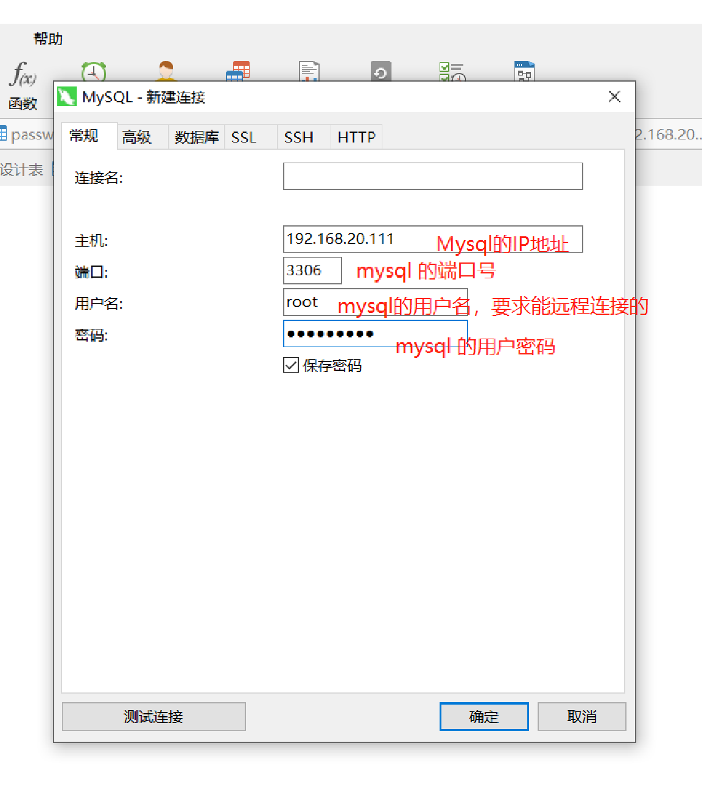
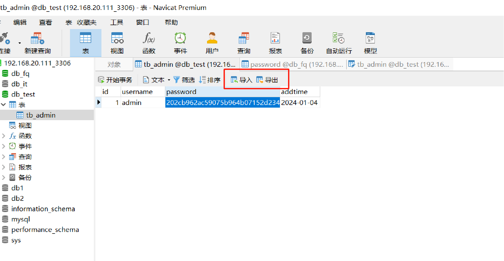
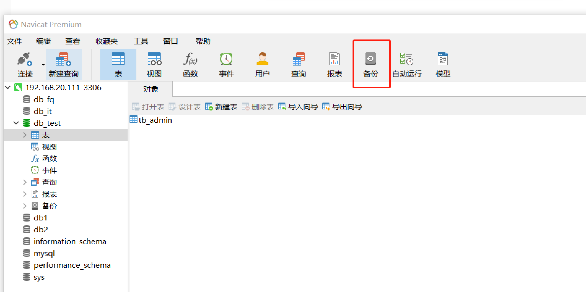
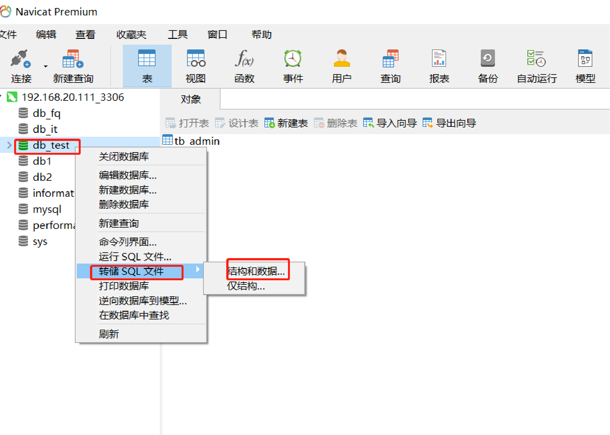
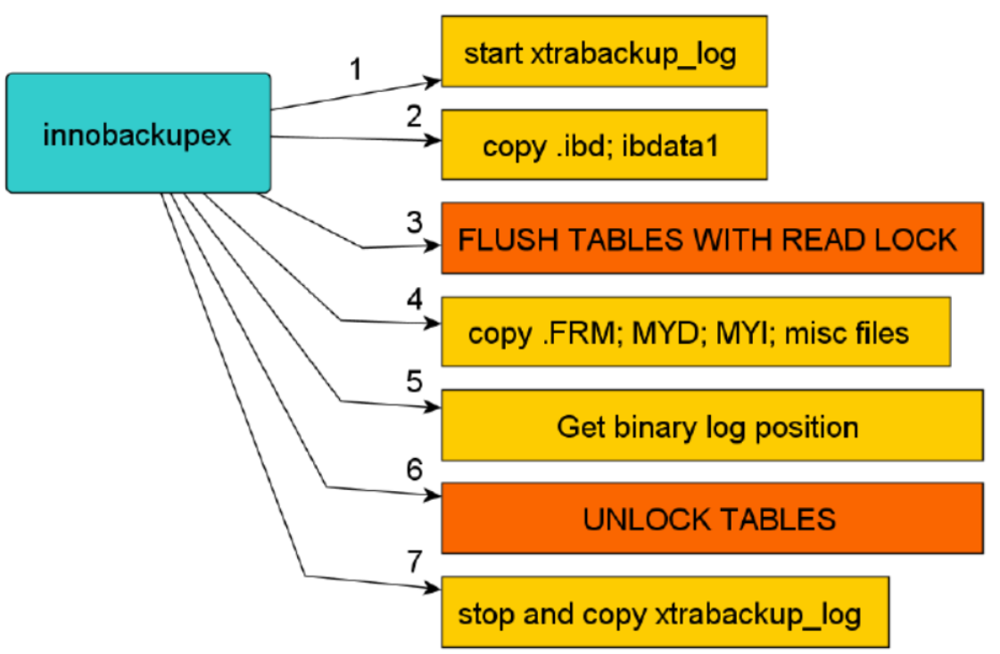
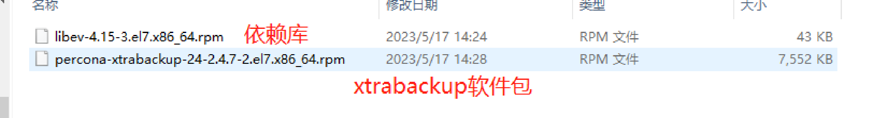
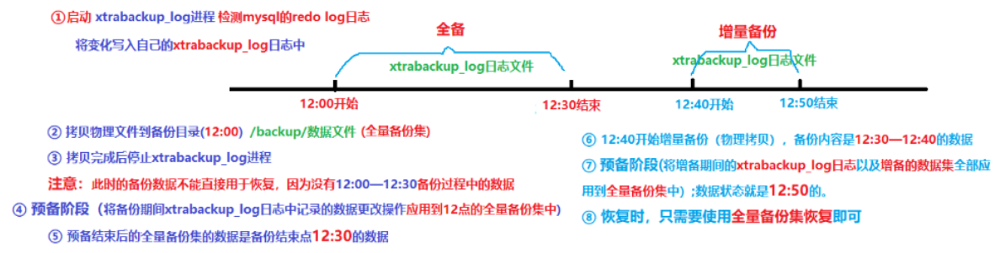

# MySQL备份与恢复（二）

# 一、逻辑备份

## 1、回顾什么是逻辑备份

逻辑备份就是把数据库、数据包或者数据进行导出，导出到一个文本文件中。


## 2、逻辑备份工具

mysqldumo：提供全库级、数据库级别以及表级别的数据备份

mysqldump+binloh：二进制日志实现增量备份


## 3、逻辑的导出与导入

### ⭐导出（数据备份）

无论是什么存储引擎，以下方式本身是一种数据导出的方法，同时可以用来辅助备份，它可以对一个表的其中一列或者某几列做备份。备份的是数据记录

案例：把tb_studeng数据表中的数据记录进行逻辑导出

```powershell
#mysql -uroot -p
Enter password:123
mysql > select * into outfile '/tmp/sqlbak/tb_student.txt' from db_fq.tb_student;

ERROR 1290 (HY000): The MySQL server is running with the --secure-file-priv option so it cannot execute this statement
```

出现以上问题的主要原因在于我们没有指定MySQL逻辑导出时指定的路径

```powershell
#vim my.cnf
[mysqld]
...
secure_file_priv=/tmp/sqlbak

#service mysql_3306 restart
```

```powershell
mysql > select * into outfile '/tmp/sqlbak/tb_student.txt' from db_fq.tb_student;
ERROR 1 (HY000): Can't create/write to file '/tmp/sqlbak/tb_student.txt' (Errcode: 13 - Permission denied)
```

出现以上问题的主要原因在于mysql账户对/tmp/sqlbak没有写入权限

```powershell
#setfacl -m u:mysql:rwx /tmp/sqlbak
```

### ⭐导入（数据还原）

```powershell
#mysql -uroot -p
Enter password:123

mysql> truncate tb_student;
mysql> load data local infile '/tmp/sqlbak/tb_student.txt' into table tb_student;
或
#mysqlimport dbname /path/file -p => 要求，导出的文件必须何数据表名称完全一致
例如：
#mysqlimport db_fq /tmp/sqlbak/tb_student.txt -p
Enter password:123
```

> 典型应用场景：可以把一些规则的文本文件导入到数据表中

案例：把/etc/passwd文件中的数据导入到password数据表中

第一步：创建一个password数据表，password是mysql保留关键字，建议适用``开办刚刚反撇号括起来

```powershell
mysql > use db_fq;
mysql> CREATE TABLE `password` (
  `uname` varchar(50) DEFAULT NULL,
  `pass` char(2) DEFAULT NULL,
  `uid` int(11) DEFAULT NULL,
  `gid` int(11) DEFAULT NULL,
  `comment` varchar(255) DEFAULT NULL,
  `home` varchar(50) DEFAULT NULL,
  `shell` varchar(50) DEFAULT NULL
) ENGINE=InnoDB DEFAULT CHARSET=utf8mb4;
```

第二步：把/etc/passwd文件拷贝到/tmpsqlbak目录下，起名叫password.txt

```powershell
#cp /etc/passwd /tmp/sqlbak/password.txt
```

第三步：使用mysqlimport把password.txt文件中的内容写入到数据表

```powershell
#mysqlimport db_fq --fields-terminated-by=':' --lines-terminated-by='\n' /tmp/sqlbak/password.txt -p

选项说明
--fields-terminated-by=':'，指定导出文件的分隔符为冒号：
--lines-terminated-by='\n'，指定每一行的结尾使用的符号,\n代表换行符

```

## 4、扩展：逻辑备份还原小工具

MySQL其实还支持很多管理软件（windows版）：MySQL-Front、Navicat


第一步：选择MySQL连接


第二步：输入MySQL连接信息



第三步：功能演示=> 创建数据库、创建数据表、插入数据...

第四步：数据库的备份与还原

①逻辑的导出与导入



②数据表的备份和还原



③数据库的备份与还原




# 二、物理备份

## 1、xtrabackup备份介绍

㈠ xtrabackup优缺点

**优点：** 

1. 备份过程==快速、可靠(==因为是物理备份)；
2. 支持==增量备份==，更为灵活
3. 备份过程**不会打断正在执行的事务**；
4. 能够基于压缩等功能节约磁盘空间和流量；
5. 自动实现备份检验；
6. ==还原速度快==； 

**缺点：**

1. 只能对innodb表增量备份，对myisam表增量备份时是全备
2. innobackupex备份MyISAM表之前要对全库进行加READ LOCK，阻塞写操作，若备份是在从库上进行的话会影响主从同步，造成延迟。对InnoDB表备份不会阻塞读写。

㈡ xtrabackup备份原理

1. innobackupex首先会==启动==一个==xtrabackup_log==后台检测的进程，实时检测mysql的==redo log==的变化，一旦发现redo有新的日志写入，立刻将日志写入到日志文件==xtrabackup_log==中。
2. ==物理==拷贝==innodb的数据文件和系统表空间文件idbdata1==到对应的以默认时间戳为备份目录的地方
3. 复制结束后，执行==flush table with read lock==操作进行全库锁表准备备份非InnoDB文件
4. 物理复制.frm .myd .myi等非InnoDB引擎文件到备份目录
5. 查看二进制日志的位置
6. 解锁表unlock tables
7. ==停止==xtrabackup_log进程




扩展：redo log日志

事务日志或称redo日志，在mysql中默认以ib_logfile0,ib_logfile1名称存在。

redo log通常是物理日志，记录的是数据页的物理修改，而不是某一行或某几行修改成怎样怎样，它用来恢复提交后的物理数据页（恢复数据页，且只能恢复到最后一次提交的位置）。

㈢ xtrabackup备份恢复原理


**具体文字描述如下（了解）：**

- 在InnoDB内部会维护一个redo日志文件，我们也可以叫做事务日志文件。事务日志会存储每一个InnoDB表数据的记录修改。当InnoDB启动时，InnoDB会检查数据文件和事务日志，并执行两个步骤：它应用（前滚）已经提交的事务日志到数据文件，并将修改过但没有提交的数据进行回滚操作。
- xtrabackup在启动时会记住log sequence number（LSN），并且复制所有的数据文件。复制过程需要一些时间，所以这期间如果数据文件有改动，那么将会使数据库处于一个不同的时间点。这时，xtrabackup会运行一个后台进程，用于监视事务日志，并从事务日志复制最新的修改。xtrabackup必须持续的做这个操作，是因为事务日志是会轮转重复的写入，并且事务日志可以被重用。所以xtrabackup自启动开始，就不停的将事务日志中每个数据文件的修改都记录下来。
- 上面就是xtrabackup的备份过程。接下来是准备（prepare）过程。在这个过程中，xtrabackup使用之前复制的事务日志，对各个数据文件执行灾难恢复（就像MySQL刚启动时要做的一样）。当这个过程结束后，数据库就可以做恢复还原了。
- 以上的过程在xtrabackup的编译二进制程序中实现。程序innobackupex可以允许我们备份MyISAM表和frm文件从而增加了便捷和功能。Innobackupex会启动xtrabackup，直到xtrabackup复制数据文件后，然后执行FLUSH TABLES WITH READ LOCK来阻止新的写入进来并把MyISAM表数据刷到硬盘上，之后复制MyISAM数据文件，最后释放锁。
- 备份MyISAM和InnoDB表最终会处于一致，在准备（prepare）过程结束后，InnoDB表数据已经前滚到整个备份结束的点，而不是回滚到xtrabackup刚开始时的点。这个时间点与执行FLUSH TABLES WITH READ LOCK的时间点相同，所以MyISAM表数据与InnoDB表数据是同步的。类似Oracle的recover和restore，InnoDB的prepare过程可以称为recover（恢复），MyISAM的数据复制过程可以称为restore（还原）。 

## 2、获取xtrabackup备份工具

网站域名：www.percona.com



## 3、xxtarbackup软件的安装

第一步：上传软件及依赖库到Linux服务器端

第二步：安装依赖库

```powershell
#rpm -ivh libev-4.15-3.el7.x86_64.rpm
```


第三步：安装xtrabackup软件

rpm安装：

下载并导入 `percona` 的 GPG 公钥： 

```powershell
# rpm --import https://www.percona.com/downloads/RPM-GPG-KEY-percona
```

安装依赖： 

```powershell
# yum install perl-DBD-MySQL perl-Digest-MD5 -y
```

安装xtrabackup：

```powershell
# rpm -ivh percona-xtrabackup-24-2.4.7-2.el7.x86_64.rpm
```


yum安装：

```powershell
#yum install percona-xtrabackup-24-2.4.7-2.el7.x86_64.rpm -y
```


## 4、xtrabackup全库备份与恢复

备份核心思路：

①使用innobackupex对数据库中的所有库进行全量备份，备份完成后，不能立即进行数据恢复（数据不完成，缺少12:00~12:30这个过程中的数据）

②预备阶段，备份过程中产生的xtrabackup_log应用到全量备份集

③模拟故障（删除数据） => rm -rf data/*

④动员运维工程师进行全库恢复

⑤测试验证

第一步：准备数据

```powershell
mysql > create database db_sql default charset=utf8;
mysql > use db_sql;
mysql > create table t1(id int,name varchar(10)) engine=myisam;
mysql > insert into t1 values (1,'吕布');
mysql > create table t2(id int,name varchar(10)) engine=innodb;
mysql > insert into t2 values (1,'貂蝉');
```

第二步：准备一个数据库备份账号，开通相应权限

```powershell
创建备份用户admin，并授予相应权限
mysql> grant reload,process,lock tables,replication client on *.* to 'admin'@'localhost' identified by 'Mysql@123456';
mysql> flush privileges;

说明：
在数据库中需要以下权限：
RELOAD和LOCK TABLES权限:为了执行FLUSH TABLES WITH READ LOCK
REPLICATION CLIENT权限：为了获取binary log位置
PROCESS权限：显示有关在服务器中执行的线程的信息（即有关会话执行的语句的信息），允许使用SHOW ENGINE
```

第三步：使用innobackupex工具进行备份

```powershell
#innobackupex --user=admin --password=Mysql@123456 /full_xtrabackup

IMPORTANT: Please check that the backup run completes successfully.
           At the end of a successful backup run innobackupex
           prints "completed OK!".

```


第一次运行报错

```powershell
240106 11:05:07  version_check Connecting to MySQL server with DSN 'dbi:mysql:;mysql_read_default_group=xtrabackup' as 'admin'  (using password: YES).
Failed to connect to MySQL server: DBI connect(';mysql_read_default_group=xtrabackup','admin',...) failed: Can't connect to local MySQL server through socket '/var/lib/mysql/mysql.sock' (2) at - line 1314.
240106 11:05:07 Connecting to MySQL server host: localhost, user: admin, password: set, port: not set, socket: not set
Failed to connect to MySQL server: Can't connect to local MySQL server through socket '/var/lib/mysql/mysql.sock' (2).

```

出现以上问题的原因主要在于我们的mysql.sock并不在/var/lib/mysql目录下，为什么会自动连接/var/liblmysql目录下的mysql.sock呢？

原因1：可能在/etc目录下还有my.cnf文件，影响了innobackupex的执行

原因2：innobackupex拥有自己的默认配置，默认读取了/var/lib/mysql/mysql.sock文件

解决方案：

方案1：把你的套接字文件创建一个软链接，放置于/var/lib/mysql/mysql.sock文件中

```powershell
#mkdir /var/lib/mysql
#ln -s /mysql_3307/mysql.sock /var/lib/mysql/mysql.sock
```

方案2：；在innobackupex中添加一个-S选项，执行套接字

```powershell
# innobackupex -S /tmp/mysql.sock --user=admin --password=mysql123 /full_xtrabackup
```

第四步：预备阶段，把备份这段时间内产生的日志整合到全量备份中

```powershell
#innobackupex --user=admin --password=Mysql@123456 --apply0-log /full_xtrabackup/2024-01-06_11-12-53
```

第五步：模拟数据库故障

```powershell
#rm -rf /mysql_3307/data/*
#pkill mysqld
```

第六步：快速的恢复数据库中的数据

```powershell
#rm -rf /mysql_3307/data/*
#innobackupex --copy-back /full_xtrabackup/2024-01-06_11-12-53
```

第一次恢复报错

```powershell
nnobackupex version 2.4.7 based on MySQL server 5.7.13 Linux (x86_64) (revision id: 05f1fcf)
Error: datadir must be specified.
```

出现以上问题的主要原因在于，innobackupex工具无法找到MySQL中的数据目录

解决方案：把my.cnf配置文件传递给innobackupex，让其自动识别这个文件中的datadir

```powershell
#innobackupex --defaults-file=/mysql_3307/my.cnf --copy-back /full_xtrabackup/2024-01-06_11-12-53
```

第七步：恢复数据时，一定要记得更改/mysql_3306/data目录下的文件拥有者以及所属组权限，否则mysql无法启动

```powershell
#chown -R mysql.mysql /mysql_3307/data
```

第八步：启动MySQL，测试是否正常

````powershell
#service mysql_3307 start
#mysql_3307 -p
Enter password:Mysql@123456
````


5、xtrabackup增量备份与恢复

什么是增量？增量一定要有一个前提，必须要现有一个全量



①全量备份

②把全量备份产生的日志整合到全量备份

③进行数据的增删改操作

④增量备份

⑤把增量备份及备份产生的日志文件全部整合到全量备份中

⑥模拟故障

⑦数据恢复

⑧启动数据库，测试验证数据

第一步：准备数据

```powershell
mysql > create database db_sql default charset=utf8;
mysql > use db_sql;
mysql > create table t1(id int,name varchar(10)) engine=myisam;
mysql > insert into t1 values (1,'吕布');
mysql > create table t2(id int,name varchar(10)) engine=innodb;
mysql > insert into t2 values (1,'貂蝉');
```

第二步：创建一个账号，专门用于备份

```powershell
创建备份用户admin，并授予相应权限
mysql> grant reload,process,lock tables,replication client on *.* to 'admin'@'localhost' identified by 'Mysql@123456';
mysql> flush privileges;

说明：
在数据库中需要以下权限：
RELOAD和LOCK TABLES权限:为了执行FLUSH TABLES WITH READ LOCK
REPLICATION CLIENT权限：为了获取binary log位置
PROCESS权限：显示有关在服务器中执行的线程的信息（即有关会话执行的语句的信息），允许使用SHOW ENGINE
```

第三步：全量备份

```powershell
# rm -rf /full_xtrabackup/*
# innobackupex --user=admin --password=Mysql@123456 /full_xtrabackup/
```

第四步：把全备过程中产生的日志进行整合

```powershell
# innobackupex --user=admin --password=Mysql@123456 --apply-log --redo-only /full_xtrabackup/2024-01-06_17-29-11
选项说明：
--apply-log  表示整合日志
--redo-only  表示只应用以及提交的事务，不回滚未提交的事务（12:00~12:30产生很多事务操作，事务处理=>开启事务，成功了提交事务，写入磁盘，失败了回滚事务，不写入硬盘）
注意：如果已经回滚了未提交事务，那么就无法再应用增量备份
/full_xtrabackup/2024-01-06_17-29-11：这个日期是备份/full_xtrabackup/目录下上一次备份的日期
```

> Preparing an Incremental Backup with innobackupex Preparing incremental backups is a bit different than full ones. This is, perhaps, the stage where more attention is needed:
> • First, only the committed transactions must be replayed on each backup. This will merge the base full backup with the incremental ones.
> • Then, the uncommitted transaction must be rolled back in order to have a ready-to-use backup.
> 对于增量备份的Prepare阶段，有2个需要注意的地方，一个是提交的事务需要replayed，一个未提交的事务需要rollback。
>
> If you replay the committed transactions and rollback the uncommitted ones on the base backup, you will not be able to add the incremental ones. If you do this on an incremental one, you won’t be able to add data from that moment and the remaining increments. Having this in mind, the procedure is very straight-forward using the --redo-only option, starting with the base backup:
> 如果在Prepare阶段replay了已提交的事务以及回滚了未提交的事务，则后续的增量备份无法添加到当前全备。因此在Prepare阶段全备应使用--redo-only选项。
>
> --redo-only should be used when merging all incrementals except the last one. That’s why the previous line doesn’t contain the --redo-only option. Even if the --redo-only was used on the last step, backup would still be consistent but in that case server would perform the rollback phase.
> 对于存在多次增量的情形，仅仅只有最后一个增量不需要使用--redo-only 选项。如果使用了的话，rollback将由服务器启动的时候来完成。

第五步：修改数据（进行增删改操作，让其产生增量数据）

```powershell
#mysql -p
Enter password:123
mysql > insert into db_sql.t1 values (2,'王朗');
mysql > insert into db_sql.t1 values (3,'袁术');
```

第六步：做增量备份

```powershell
#innobackupex --user=admin --password=Mysql@123456  --incremental /incre_backup --incremental-basedir=/full_xtrabackup/2024-01-06_17-29-11

选项说明：
 --incremental 增量备份目录
 --incremental-basedir 这个增量是相对于哪个全量的
```

第七步：把增量备份产生的数据以及日志文件整合到全量备份中

```powershell
#innobackupex --user=admin --password=Mysql@123456 --apply-log /full_xtrabackup/2024-01-06_17-29-11 --incremental-dir=/incre_backup/2024-01-06_17-39-15

说明：
1.--redo-only除了最后一个不用加之外，其他的增量应用都要加，最后一个应用的时候可以直接进入回滚未提交事务阶段;如果加了也没事，服务启动的时候会进入recovery过程，来回滚
2.应用增量备份的时候只能按照备份的顺序来应用。如果应用顺序错误，那么备份就不可用。如果无法确定顺序，可以使用xtrabackup-checkpoints来确定顺序。
周天做了一个全量，周一、周二、周三、周四、周五、周六全部做增量
```

到此，增量备份就全部结束了

第八步：模拟数据库故障

```powershell
#rm -rf /mysql_3307/data/*
#pkill mysqld
```

第九步：数据恢复

```powershell
#innobackupex --defaults-file=/mysql_3307/my.cnf --user=admin --password=Mysql@123456 --copy-back    /full_xtrabackup/2024-01-06_17-29-11

#chown -R mysql.mysql /mysql_3307/data
```

启动数据库，测试验证是否正常

```powershell
#service mysql_3307 start
#mysql -p
Enter password:123
mysql > use db_sql;
mysql > select * from t1;
```

