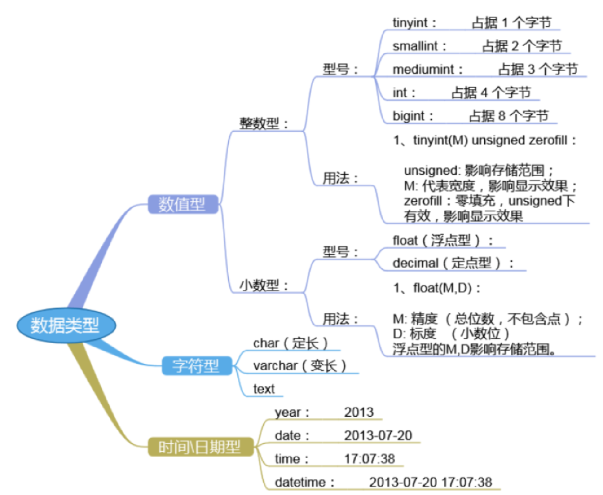
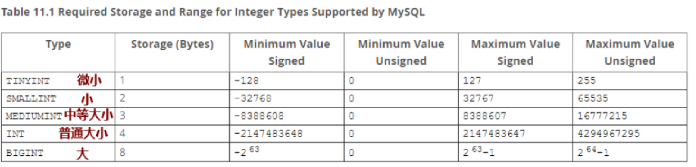
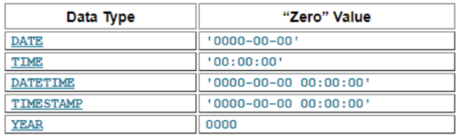
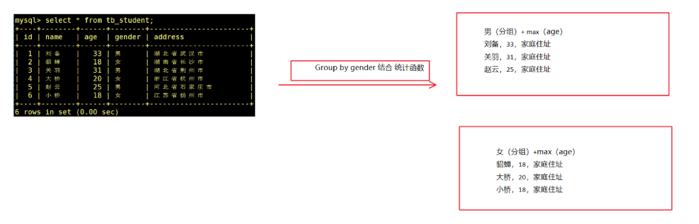
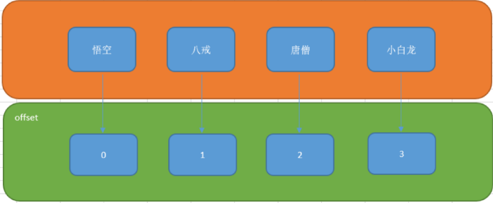
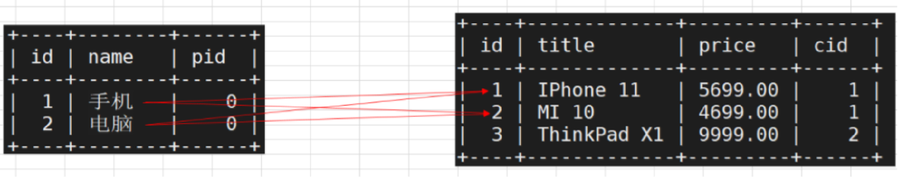

# MySQL的基本SQL语句（下）

# 一、常见的数据类型

## 1、回顾数据表的创建语法

基本语法：

```powershell
mysql > create table 数据表名称（
	字段名称1 字段类型 字段约束
	字段名称1 字段类型 字段约束
	...
	primary key（主键字段 => 不能为空、必须唯一）
）engine=innodb default charset=utf8;
```

> 经验：一般情况下，我们在设计数据表时，必须拥有一个id主键字段，非空，自动编号，主键约束

在创建数据表时，必须明确指定字段的名称以及字段的类型，那到底Mysql中的SQL语句支持哪些字段类型呢？

参考下图



## 2、数值类型

### ⭐整数类型（整数、精准）



应用场景：人的年龄、考试成绩等等相关的信息都可以使用整数类型进行存储，那整数类型有这么多的形式，我应该选择哪一个呢？

答：整数类型的选择主要取决于数值的范围

> 比如存储中国的人口类型，可以用INT类型或者BIGINT类型，但是在数据库设计原则中，不是越大越好，而是正好满足条件即可。

案例：设计一个数据表如tb_student学生表（id,username,age,modile）

```powershell
mysql > use 数据库名称；
MySQL > create table tb_student(
	id mediumint unsigned not null auto_increment,
	username varchar(20),
	age tinyint unsigned,
	mobile char(11),
	primary key(id)
) engine=innodb default charset=utf8;
```

### ⭐小数类型（浮点类型、定点类型）

#### ①浮点类型（近似值）

FLOAT和DOUBLE

float和double类型代表近似数字数据值。Mysql对于单精度值使用四个字节，对于双精度值使用八个字节。FLOAT单精度浮点数精确到7位小数，double双精度浮点数精确道大约15位小数。float类型会随着数值的增大精度会减小

举例：

FLOAT（M,D），M表示存储的有效位数，D代表小数点后面的位数；即整数位数+小数部分不能超过M值。

colum1 FLOAT(7,4)

如果插入一个999.00009到cloum1列，那么mysql在存储时会四舍五入变为999.0001插入

> DOUBLE(7,4)：DOUBLE类型的使用与FLOAT类型完全一致，唯一的区别就是占用字节不同浮点数的精度有所不同。

#### ②定点类型（精确值）

DECIMAL和NUMERIC

DECIMALE和NUMERIC类型的存储精确的数值数据。使用这些类型时，重要的时要保留精确的精度，例如使用货币数据。

举例说明：

```powershell
salary DECIMAL(5,2)
在上面的例子中，薪水字段的类型为decimal，表示精确的数字。其中，5代表精度，2代表刻度。
精度表示数值存储的有效位数，刻度表示小数点后面可存储的位数。
DECIMAL(5,2)能够存储五位数和两位小数的任何值，因此可以存储在salary 列中的值的范围-999.99是 999.99

特殊注意：
DECIMAL(M)和DECIMAL(M,0)是相等的，存储长度取决于M的值，默认情况下M值为10.刻度为0表示没有小数。
```

案例：定义一个职员表tb_staff，定义字段（id,username,salary,addtime）

```powershell
mysql > use db_fq;
mysql > create table tb_staff(
	id smallint unsigned not null auto_increment,
	username varchar(20),
	salary decimal(11,2),
	addtime date,
	primary key(id)
) engine=innodb default charset=utf8;
```

## 3、字符串类型

### ⭐CHAR类型

CHAR类型的字符串为定长，长度范围是0到255之间的任何值，占用定长的存储空间，不足的部分用空格填充；读取时删掉后面的空格。

password char (32)

username (10)

#### ①存储空间

CHAR（M）类型的存储空间和字符集有关系，一个中文在utf8字符集中占用3个bytes、gbk占用2个bytes、数字和字符统一用一个字符表示。

#### ②存储机制

在不够M长度时，Mysq老在存储数据时，需要填充特殊的空格

#### ③举例说明

字段名称 CHAR（M），M表示字符数

应用场景：加密后的密码=>char(32)，手机号码mobile（11），身份证号码等待

案例：创建一个tb_admin数据表，定义字段（id,username,password）

```powershell
mysql > use db_fq;
mysql > create table tb_admin(
	id tinyint unsigned not null auto_increment,
	username varchar(10),
	password char(32),
	primary key(id)
) engine=innodb default charset=utf8;
```

### ⭐varchar类型

varchar是变长存储，仅使用必要的存储空间

name varchar(10)

#### ①存储空间

VARCHAR（M）类型的存储空间和字符集有关，一个中文在utf8中占用3各bytes、gbk占用2各bytes、数字和字符用一个字符表示

#### ②存储机制

VARCHAR（M）字段存储实际是从第二个字节开始存储，然后用1到2各字节表示实际长度，剩下的才是可以存储数据的范围，因为最大可用存储范围是65535-3=65532字节；

第一个字节标识是否为空（长度小于255字节，使用一个字节来表示长度；大于255字节使用两个字节来表示长度）。

应用场景：主要适合存储长度不固定的字符串信息，入用户名称、产品标题、新闻标题、新闻描述（不超过255个字符）

案例：创建一个tb_news数据表，定义段（id、title、description、addtime）

```powershell
mysql > use db_fq;
mysql > create table tb_news(
	id int not null auto_increment,
	title varchar(80),
	description varchar(255),
	addtime date,
	primary key(id)
)engine=innodb default charset=utf8;
```

### ⭐TEXT类型

TEXT代表的是文本类型的数据，当我们使用VARCHAR类型存储数据时（早期最大只能存储255个字符，mysql5版本中，gbk可用存储3万多个字符，utf格式可用存储2万多个字符），如果超过了VARCHAR的最大存储范围，则可以考虑使用TEXT文本类型

> 经验之谈：255个字符以内（包括），定长就使用CHAR类型，变长就使用VARCHAR类型，如果超过了255个字符，则使用TEXT文本类型

应用场景：文本内容、产品的详细介绍等

案例：创建一个tb_goods产品表、定义字段（id、name、price、content）

```m
mysql > use db_fq;
mysql > create table tb_goods(
	id int not null auto_increment,
	name varchar(80),
	price decimal(11,2),
	content text,
	primary key(id)
)engine=innodb default charset=utf8;
```

⭐其他类型

BLOB：保存二进制的大型数据（字符串），没有字符集，eg:图片、音频、视频等

> 实际的运维工作中，很少将文件之间保存在数据库端，一般文件的存储都是基于路径操作

ENUM枚举类型：多选一，从给定的多个选择中选择一个，如gender enum（'男','女','保密'）

SET集合类型：多选多，从给定的多个选项中选中多个，如hobby set('吃饭','睡觉','看书')

## 4、日期时间类型



> 经验：时间的选择比较简单，主要看你需要的时间格式，是年月日、小时分钟秒等等

###㈠ DATE类型（年-月-日）

The `DATE` type is used for values with a date part but no time part. MySQL retrieves and displays `DATE` values in`'YYYY-MM-DD'` format. The supported range is `'1000-01-01'` to `'9999-12-31'`.

###㈡ DATETIME（年月日小时分钟秒）

The `DATETIME` type is used for values that contain both date and time parts. MySQL retrieves and displays`DATETIME` values in `'YYYY-MM-DD HH:MM:SS'` format. The supported range is `'1000-01-01 00:00:00'` to `'9999-12-31 23:59:59'`.

```powershell
DATETIME范围相对于TIMESTAMP范围更广，1000-01-01 00:00:00'` to `'9999-12-31 23:59:59'`
```

###㈢ TIMESTAMP（年月日小时分钟秒）

The `TIMESTAMP` data type is used for values that contain both date and time parts. `TIMESTAMP` has a range

```powershell
TIMESTAMP选项如果不插入时间，则MYSQL会自动调用系统时间写入数据
```

###㈣ TIME（小时：分钟：秒）

MySQL retrieves and displays `TIME` values in `'HH:MM:SS'` format (or `'HHH:MM:SS'` format for large hours values).`TIME` values may range from `'-838:59:59'` to `'838:59:59'`.

**说明：**小时部分可以是这么大，因为可以使用TIME类型不仅代表一个时间(必须小于24小时),而且可以表示运行时间或两个事件之间的时间间隔(可能大于24小时,甚至负数)。

**==注意：==**

TIME这一列如果存储缩写，需要注意mysql的解释方式。**无效的时间值会被转换成'00:00:00'** 。

###㈤ YEAR

`YEAR(4)` and `YEAR(2)` differ in display format, but have the same range of values.

For 4-digit format, MySQL displays `YEAR` values in `YYYY` format, with a range of `1901` to `2155`, or `0000`.

For 2-digit format, MySQL displays only the last two (least significant) digits; for example, `70` (1970 or 2070) or `69` (2069).

**无效的值将会被转换成'0000'.**

案例：编写tb_article文章表，定义字段（id、title、description、addtime）

```powershell
mysql > use db_fq:
mysql > create table tb_article1(
	id int not null auto_increment,
	title varchar(80),
	description varchar(255),
	addtime datetime,
	primary key(id)
)engine=innodb default charset=utf8;

mysql > create table tb_article2(
	id int not null auto_increment,
	title varchar(80),
	description varchar(255),
	addtime timestamp,
	primary key(id)
)engine=innodb default charset=utf8;

mysql > insert into tb_article1 values (null,'mysql你好','mysql很好用',null);

mysql > insert into tb_article2 values (null,'mysql你好','mysql很好用',null);
```

# 二、SQL查询语句（重点）

## 1、回顾SQL查询语句

基本语法：

```powershell
mysql > select */字段列表  from 数据表名称 where查询条件;
```

## 2、SQL查询五子句

基本语法：

```powershell
mysql > select */字段列表 from 数据表名称 where 子句 group by 子句 having 子句 order by 子句 limit 子句;
```

①where子句

②group by子句

③having子句

④order by子句

⑤limit子句

> 特别注意：五子句的顺序是固定的，不能颠倒

## 3、WHERE子句

## 


| 符号              | 说明                  |
| ----------------- | --------------------- |
| %                 | 匹配0个或任意多个字符 |
| _(下划线)         | 匹配单个字符          |
| like              | 模糊匹配              |
| =                 | 等于,精确匹配         |
| >                 | 大于                  |
| <                 | 小于                  |
| \>=               | 大于等于              |
| <=                | 小于等于              |
| !=和<>            | 不等于                |
| ! 和 not          | 逻辑非                |
| \|\| 和 or        | 逻辑或                |
| && 和 and         | 逻辑与                |
| between...and.... | 两者之间              |
| in (....)         | 在...                 |
| not in (....)     | 不在                  |

准备测试数据

```powershell
mysql > use db_fq;
mysql > create table tb_student(
	id mediumint not null auto_increment,
	name varchar(20),
	age tinyint unsigned default 0,
	gender enum('男','女'),
	address varchar(255),
	primary key(id)
) engine=innodb default charset=utf8;

插入测试数据
mysql > insert into tb_student values (null,'刘备',33,'男','湖北省武汉市');
mysql > insert into tb_student values (null,'貂蝉',18,'女','湖南省长沙市');
mysql > insert into tb_student values (null,'关羽',31,'男','湖北省荆州市');
mysql > insert into tb_student values (null,'大桥',20,'女','浙江省杭州市');
mysql > insert into tb_student values (null,'赵云',25,'男','河北省石家庄市');
mysql > insert into tb_student values (null,'小桥',18,'女','江苏省扬州市');
```

案例：使用like模糊查询语句，查询姓"关" 的同学信息

```powershell
mysql > select * from tb_student where name like '关%';
```

> like模糊查询，有点类似于管道命令中的数据检索。有两个关键字：%和_，%百分号代表任意个任意字符，_下划线代表任意的某个字符（只能匹配一个）

案例：like模糊查询语句，查询名字中带"蝉"字的同学信息

```powershell
mysql > select * from tb_student where name like '%蝉%';
```

案例：like模糊查询语句，查询云字结尾且名字为两个字的同学信息

```powershell
mysql > select * from tb_student where name like '_云';
```

案例：获取学生表中，id编号为3的同学信息

```powershell
mysql > select * from tb_student where id=3;
```

案例：获取年龄大于25周岁的同学信息

```powershell
mysql > select * from tb_student where age>25;
```

案例：获取学生表中，性别不为男的同学信息（获取女同学的信息）

```powershell
mysql > select * from tb_student where gender<>'男';
```

案例：获取班级中年龄大于30岁的男同学信息

```powershell
mysql > select * from tb_student where age>30 && gender='男';
```

案例：获取id值为1、3、5的同学信息

```powershell
mysql > select * from tb_student where id=1 or id=3 or id=5;
```

案例：获取年龄在18周岁~25周岁之间的同学信息

```powershell
mysql > select * from tb_student where age>=18 and age<=25;
或
mysql > select * from tb_student where age between 18 and 25;
```

案例：获取id值为2、4、6的同学信息

```powershell
mysql > select * from tb_student where id in (2,4,6);
```

## 4、DISTINCT数据去重

案例：获取tb_student学生表中学员年龄的分布情况。  u

```powershell
mysql > select distinct age from tb_student;
```

## 5、GROUP BY子句（重点和难度）

group by子句的作用：对数据进行分组操作，为什么要进行分组呢？分组的目标就是进行分组统计

> 日常生活中的分组太多了，如按男女进行分组，按成绩进行分组，按院校，系部分组，按部门进行分组。

根据给定数据列的查询结果进行分组统计，最终得到一个分组汇总表

注：一般情况下group by 需与统计函数一起使用才有意义

### ①统计函数


| 常见统计函数 | 说明     |
| ------------ | -------- |
| max          | 求最大值 |
| min          | 求最小值 |
| sum          | 求和     |
| avg          | 求平均值 |
| count        | 求总行数 |

案例：求tb_student表中一共有多少个记录

```powershell
mysql > select count(*) from tb_student;
```

案例：求年龄的最大值与最小值

```powershell
mysql > select max(age) from tb_student;
与
mysql > select min(age) from tb_student;
```

案例：求针对id字段求和

```powershell
mysql > select sum(id) from tb_student;
```

案例：求学员表中年龄的平均值

```powershell
mysql > select avg(age) from tb_student;
```

### ②GROUP BY分组

案例：求tb_student表中，男同学的总数量与女同学的总数量

```powershell
mysql > select gender,count(*) from tb_student group by gender;
```

> 在MySQL5.7以后版本中，分组字段必须出现在select后面的查询字段中

案例：求tb_student表中，男同学年龄的最大值与女同学年龄的最大值

```powershell
mysql > select gender,max(age) from tb_student group by gender;
```

### ③GROUP BY分组原理



> 以后只要涉及到要求每个学科，每个部分、每个年级、每个系部薪资最高、成绩最好、薪资的平均值等等，就是基于GROUP BY + 统计函数

## 6、HAVING子句

having与where类似，根据条件对数据进行过滤筛选

where针对表中的列发挥作用，查询数据

having针对查询结果集发挥作用，筛选数据

案例：having在做简单查询时可以替代where子句

```powershell
mysql > select * from tb_student having age>20;
```

案例：按学科进行分组，求每个学科拥有多少人

```powershell
mysql > drop table tb_student;
mysql >  create table tb_student(
	id mediumint not null auto_increment,
	name varchar(20),
	age tinyint unsigned default 0,
	gender enum('男','女'),
	subject enum('ui','java','yunwei','python'),
	primary key(id)
) engine=innodb default charset=utf8;

mysql> insert into tb_student values (null,'悟空',255,'男','ui');
mysql> insert into tb_student values (null,'八戒',250,'男','python'),;
mysql> insert into tb_student values (null,'唐僧',30,'男','yunwei');
mysql> insert into tb_student values (null,'沙僧',150,'男','java');
mysql> insert into tb_student values (null,'小白龙',100,'男','yunwei');
mysql> insert into tb_student values (null,'白骨精',28,'女','ui');
mysql> insert into tb_student values (null,'兔子精',22,'女','yunwei');
mysql> insert into tb_student values (null,'狮子精',33,'男','yunwei');
或
insert into tb_student values(null,'悟空',255,'男','ui'),(null,'八戒',250,'男','python'),(null,'唐僧',30,'男','yunwei'),(null,'沙僧',150,'男','java'),(null,'小白龙',100,'男','yunwei'),(null,'白骨精',28,'女','ui'),(null,'兔子精',22,'女','yunwei'),(null,'狮子精',33,'男','yunwei');
```

```powershell
mysql > select subject,count(*) from tb_student group by subject;
```

案例：求每个学科中，学科人数大于3人的学科信;

```powershell
mysql > select subject,count(*) from tb_student group by subject having count(*)>3;
```

## 7、ORDER BY子句

主要作用就是对数据进行排序（升序、降序）

升序：从小到大 1，2，3，4，5

```powershell
mysql > select * from 数据表名称 ... order by 字段名称 asc;
```

降序：从大到小，5，4，3，2，1

```powershell
mysql > select * from 数据表名称 ... order by 字段名称 desc;
```

案例：按年龄进行排序（由大到小）

```powershell
mysql > select * from tb_student order by age desc;
```

## 8、LIMIT子句

基本语法：

```powershell
mysql > select * from 数据表名称 ... limit numer;查询满足条件的number数量
或
mysql > select * from 数据表名称 ... limit offset,number; 从偏移量为offset开始查询，查询number条记录，offset的值从0开始
```

offset偏移量：



案例：获取学生表中，年龄最大的学员

```powershell
mysql > select * from tb_student order by age desc limit 1;
```

案例：从偏移量为1的元素开始查询，查询2条记录

```powershell
mysql > select * from tb_student limit 1,2;
```

> limit子句在开发项目中，主要应用于数据分页。

案例：实现数据分页

第一页：

```powershell
mysql > select * from tb_student limit 0,2;
```

第二页：

```powershell
mysql > select * from tb_student limit 2,2;
```

# 三、SQL多表查询

## 1、什么是多表查询

我们刚才学习的SQL五子句都主要是针对单表情况，我们在实际工作中，也可能会接触到一些复制的多表查询

## 2、union联合查询

UNION联合查询的作用：把多个表中的数据联合在一起进行显示。应用场景：分库分表

第一步：创建两个结构相同的学生表tb_student1于tb_student2

```powershell
mysql > create table tb_student1(
	id mediumint not null auto_increment,
	name varchar(20),
	age tinyint unsigned default 0,
	gender enum('男','女'),
	subject enum('ui','java','yunwei','python'),
	primary key(id)
) engine=innodb default charset=utf8;
mysql > insert into tb_student1 values (1,'悟空',255,'男','ui');

mysql > create table tb_student2(
	id mediumint not null auto_increment,
	name varchar(20),
	age tinyint unsigned default 0,
	gender enum('男','女'),
	subject enum('ui','java','yunwei','python'),
	primary key(id)
) engine=innodb default charset=utf8;
mysql > insert into tb_student2 values (2,'唐僧',30,'男','yunwei');
```

​	第二步：使用UNION进行联合查询

```powershell
mysql > select * from tb_student1 union select * from tb_student2;
```

## 3、交叉查询（了解）

基本语法：

```powershell
mysql > select */字段列表  from 数据表1,数据表2;
或
mysql > select */字段列表 form 数据表1 cross join 数据表2;
```

tb_category

```powershell
mysql > create table tb_category(
	id smallint not null auto_increment,
	name varchar(20),
	pid smallint default 0,
	primary key(id)
) engine=innodb default charset=utf8;

insert into tb_category values (null,'手机',0);
insert into tb_category values (null,'电脑',0);
insert into tb+category valuse (null,'游戏手机',1);    =>游戏手机属于手机分类
```

> pid代表所属的父级类别，如果自己就是顶级分类，则为0

tb_goods

```powershell
mysql> create table tb_goods(
	id int not null auto_increment,
	title varchar(80),
	price decimal(11,2),
	cid smallint default 0,
	primary key(id)
) engine=innodb default charset=utf8;

insert into tb_goods values (null,'IPhone 11',5699.00,1);
insert into tb_goods values (null,'MI 10',4699.00,1);
insert into tb_goods values (null,'ThinkPad X1',9999.00,2);

insert into tb_goods values (null,'Nike gt',999.00,10);
```

> cid代表产品的所属分类编号，与tb_category要一一对应

案例：把分类表与产品进行交叉，就结果

```powershell
mysql >select * from tb_category cross join tb_goods;
```



> 交叉连接本身是没有意义的，其只是强制把两个表甚至多个表进行连接在一起。但是交叉查询中也有正确的结果，所以我们所谓的多表连接只需要在交叉连接的基础上增加一个连接条件，则就是我们想要的结果了。所以交叉查询是多表查询的基础

## 4、内连接查询

基本语法：

```powershell
mysql > select 数据表1.字段列表，数据表2.字段列表 from 数据表1 inner join 数据表2 on 连接条件；
```

案例：获取产品表中每个产品的分类信息

```powershell
mysql> select tb_goods.*,tb_category.name from tb_goods inner join tb_category on tb_goods.cid=tb_category.id;
```

> 内连接查询：把两个表甚至多个表进行连接，然后拿表1 中的每一条记录与表2中的每一条记录进行匹配，如果有与之对应的结果，则显示。反之，则忽略这条记录

## 5、外连接查询

内连接查询要求：表1和表2中的每一条记录都必须要一一对应，如果无法匹配，则这条记录会被自动忽略掉，那如果我需要保留表1中的所有记录或表2 中的所有记录怎么办呢？

答：可以使用外连接查询

基本语法：

左连接查询：把左表中的每一条数据都保留，右表匹配到结果就显示，匹配不到就NULL

```powershell
select 数据表1.字段列表,数据表2.字段列表 from 数据表1 left 数据表2 on 连接条件；
```

右连接查询：把右表中的每一条数据都保留，左表匹配到结果就显示，匹配不到就NULL

```powershell
select 数据表1.字段列表,数据表2.字段列表 from 数据表1 right join 数据表2 on 连接条件；
```

案例：获取产品表中每个产品的分类信息（无论匹配到与否）

```powershell
mysql > select tb_goods.*,tb_category.name from tb_goods left join tb_category on tb_goods.cid=tb_category.id;
```

## 6、别名机制：简化内外连接

案例：获取产品表中每个产品的分类信息（无论匹配到与否）

原始语句：

```powershell
mysql > select tb_goods.*,tb_category.name from tb_goods left join tb_category on tb_goods.cid=tb_category.id;
```

给数据表起个简单的名字，如tb_category叫c，tb_goods叫做g

```powershell
①mysql > select * from tb_goods left join tb_category;

起别名
②mysql > select * from tb_goods g left join tb_category c;

写on条件
③mysql > select * from tb_goods g left join tb_category c on g.cid=c.id;

筛选字段
④mysql > select g.*,c.name from tb_goods g left join tb_category c on g.cid=c.id;
```
