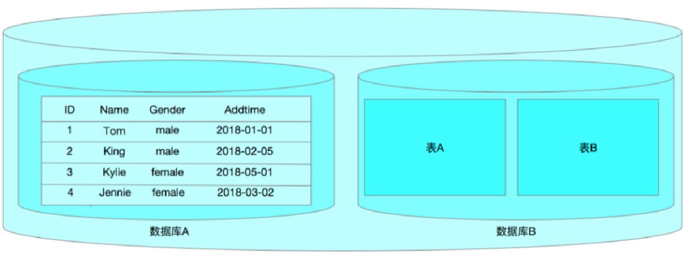

# Mysql基本SQL语句（上）

# 一、客户端工具的使用

## 1、客户端工具mysql使用

```powershell
mysql:mysql命令行工具，一般用来连接访问mysql数据库
```


| 选项               | 说明                                       |
| ------------------ | ------------------------------------------ |
| -u, --user=name    | 指定登录用户名                             |
| -p, --password     | 指定登录密码(注意是小写p),一定要放到最后面 |
| -h, --host=name    | 指定数据库的主机地址                       |
| -P, --port=xxx     | 指定数据库的端口号(大写P)                  |
| -S, --socket=name  | 指定socket文件                             |
| -e, --execute=name | 使用非交互式操作(在shell终端执行sql语句)   |

案例：使用mysql客户端工具连接服务器端（用户名：root，密码：123）

```powershell
#mysql -uroot -p123
```

注意：以上连接方式虽然可以连接进入到Mysql，但是官方不建议直接把密码写入终端，建议-p然后直接回车，然后在终端中输入密码

案例：连接192.168.20.100服务器上的Mysql数据库（用户名：mq，密码：123）

```powershell
#msyql -h 192.168.20.100 -P 3306 -umq -p
Enter password:123
```

案例：根据不同的套接字连接不同的数据库

```powershell
 #mysql -S /mysql_3307/mysql.sock -uroot -p

```

案例：在不进入MySQL内部的情况下，执行SQL语句，获取数据信息

```powershell
## mysql -e "show databases;" -uroot -p
Enter password:123
```

扩展了解


| 默认库             | 描述                                                                                                                                                                                                                                                                                                                                                                                                  |
| ------------------ | ----------------------------------------------------------------------------------------------------------------------------------------------------------------------------------------------------------------------------------------------------------------------------------------------------------------------------------------------------------------------------------------------------- |
| information_schema | 1、==对象信息数据库==，提供对数据库元数据的访问 ，有关MySQL服务器的信息，例如数据库或表的名称，列的数据类型或访问权限等；<br>2、在INFORMATION_SCHEMA中，有数个只读表，它们实际上是视图，而不是基本表，因此你将无法看到与之相关的任何文件；<br>3、视图，是一个虚表，即视图所对应的数据不进行实际存储，数据库中只存储视图的定义，在对视图的数据进行操作时，系统根据视图的定义去操作与视图相关联的基本表 |
| mysql              | 1、mysql数据库是==系统数据库==。它包含存储MySQL服务器运行时所需的信息的表。比如权限表、对象信息表、日志系统表、时区系统表、优化器系统表、杂项系统表等。<br>2、==不可以删除==,也不要轻易修改这个数据库里面的表息。                                                                                                                                                                                     |
| performance_schema | MySQL5.5开始新增一个数据库，主要用于==收集数据库服务器性能==；并且库里表的存储引擎均PERFORMANCE_SCHEMA，而用户是不能创建存储引擎为PERFORMANCE_SCHEMA的表                                                                                                                                                                                                                                              |
| sys                | 1、mysql5.7增加了sys 系统数据库，通过这个库可以快速的了解系统的元数据信息；<br>2、sys库方便DBA发现数据库的很多信息，解决性能瓶颈；<br>3、这个库是通过视图的形式把information_schema 和performance_schema结合起来，查询出更加令人容易理解的数据                                                                                                                                                        |

## 2、客户端工具mysqladmin使用

```powershell
mysqladmin:客户端管理mysql数据库工具
```

①常用选项


| 选项              | 描述                 |
| ----------------- | -------------------- |
| -h, --host=name   | 指定连接数据库主机   |
| -p, --password    | 指定数据库密码       |
| -P, --port=#      | 指定数据库端口       |
| -S, --socket=name | 指定数据库socket文件 |
| -u, --user=name   | 指定连接数据库用户   |

②常用命令


| 命令                    | 描述                          |
| ----------------------- | ----------------------------- |
| password [new-password] | 更改密码                      |
| reload                  | 刷新授权表                    |
| shutdown                | 停止mysql服务                 |
| status                  | 简短查看数据库状态信息        |
| start-slave             | 启动slave                     |
| stop-slave              | 停止slave                     |
| variables               | 打印可用变量                  |
| version                 | 查看当前mysql数据库的版本信息 |

案例：更改root账户的密码为root

```powershell
#mysqladmin password '新密码' -p
Enter password: '旧密码'

#mysqladmin password 'root' -p
Enter password:123
```

案例：更改密码后，建议刷新授权表(mysql > flush privileges;)

```powershell
#mysqladmin reload -p
Enter password:123
```

案例：停止mysql

```powershell
#mysqladmin shutdown -p
Enter password:123
```

> service mysql_3306 stop

案例：查看mysql状态:

```powershell
#musqladmin status -p
Enter password:123
```

案例：打印可用变量（mysql本身预置了很多变量信息）

```powershell
#mysqladmin variables -p
Enter password:123
```

案例：查询mysql版本

```powershell
#mysqladmin version -p
Enter password:123
```

# 二、MySQL中的SQL语句

## 1、什么是SQL

SQL 是 Structure Query Language(==结构化查询语言==)的缩写,它是使用==关系模型的数据库应==
==用语言==,由 IBM 在 20 世纪 70 年代开发出来,作为 IBM 关系数据库原型 System R 的原型关
系语言,实现了关系数据库中的信息检索。

20 世纪 80 年代初,美国国家标准局(ANSI)开始着手制定 SQL 标准,最早的 ANSI 标准于
1986 年完成,就被叫作 SQL-86。标准的出台使 SQL 作为标准关系数据库语言的地位得到了
加强。SQL 标准目前已几经修改更趋完善。

正是由于 SQL 语言的标准化,所以大多数关系型数据库系统都支持 SQL 语言,它已经发展
成为多种平台进行交互操作的底层会话语言。

## 2、SQL语句的分类

- DDL(Data Definition Languages)语句:

  ==数据定义语言==,这些语句定义了不同的数据段、数据库、表、列、索引等数据库对象的定义。常用的语句关键字主要包括 **create、drop、alter、rename、truncate**。
- DML(Data Manipulation Language)语句:

  ==数据操纵语句==,用于添加、删除、更新和查询数据库记录,并检查数据完整性,常用的语句关键字主要包括 **insert、delete、update**等。
- DCL(Data Control Language)语句:

  ==数据控制语句==,用于控制不同数据段直接的许可和访问级别的语句。这些语句定义了数据库、表、字段、用户的访问权限和安全级别。主要的语句关键字包括 **grant、revoke** 等。
- DQL(Data Query Language)语句:

  ==数据查询语句==，用于从一个或多个表中检索信息。主要的语句关键字包括 **select**

## 3、MySQL中如何求帮助

①亘古不变的官方文档（软件作用）

https://dev.mysql.com/doc/refman/5.7/en/sql-syntax.html （MySQL5.7）

②man文档（工作作用）

man文档可用对mysql的一些基本工具以及后台命令求帮助，比如：

```powershell
[root@mysql ~]# man mysql
[root@mysql ~]# man mysqld
[root@mysql ~]# man mysqldump

```

③MySQL的命令行求帮助（主要针对SQL语句求帮助）

```powershell
mysql> help;
mysql> ?
mysql> help create table;

根据内容进行查找帮助
mysql> ? contents
mysql> help contents
You asked for help about help category: "Contents"
For more information, type 'help <item>', where <item> is one of the following
categories:
   Account Management
   Administration
   Compound Statements
   Contents
   Data Definition
   Data Manipulation
   Data Types
   Functions
   Geographic Features
   Help Metadata
   Language Structure
   Plugins
   Procedures
   Storage Engines
   Table Maintenance
   Transactions
   User-Defined Functions
   Utility

寻求账户管理的帮助（一级一级的向内查询）
mysql> ? Account Management
You asked for help about help category: "Account Management"
For more information, type 'help <item>', where <item> is one of the following
topics:
   ALTER USER
   CREATE USER
   DROP USER
   GRANT
   RENAME USER
   REVOKE
   SET PASSWORD

mysql> ? CREATE USER

```

> 在Mysql内部，没有clear命令，也无法使用clear实现清屏，如果想实现清屏操作，可用使用shift+ctrl+l

## 4、SQL语句的基本操作

### MySQL的内部结构



MySQL（DBMS）

> 我们平常所说的MySQL，主要指的是MySQL数据库管理软件

一个MYsql  DBMS可用同时存放多个数据库，在理论上一个就对应一个数据库。如博客项目blog数据库、商城项目shop数据库、微信项目数据库。

一个数据库中还可以同时包含多个数据表，而数据表才是真正用于存放数据的位置。（类似与我们office软件中的Excel表格），在理论上一个功能旧对应一个数据表。在博客系统中的用户管理功能，就需要一个USER数据表，博客中的文章就需要一个article数据表、博客中的评论就需要个message数据表。

一个数据表又可以拆分为多个字段，每个字段就是一个属性。

一个数据表中除了字段外，还有很多行，每一行都是一条完整的数据（记录）。

### 数据库的操作

#### ①创建数据库

创建 =>creat

数据库=> database

基本语法：

```powershell
mysql> create database 数据库名称；
```

> 特别注意，在Mysql中，当一条SQL语句编写完毕后，一定要使用分号进行结尾，否则系统认为这条语句还没有借宿。

案例：创建数据库的相关案例

```powershell
常见db1库
create database db1;

创建db2库并指定默认字符集
create database db2 default charset gbk;

如果不存在（if not exists）
create database if not exists db1 default character set utf8;
说明：不能创建相同名字的数据库
```

> 扩展：编码格式，常见的gbk（中国的编码格式）与utf8（国际通用的编码格式）

ANSI 瑞典 256字符  (abcd、1234、传统字符)

国内汉字无法通过256个字符进行描述，所以国内开发了自己的编码格式gb2312，升级gbk

中国台湾开发了一套自己的编码格式big5

很多项目并不仅仅只在本地使用，也可能支持多国语言，标准化组织开发了一套通用编码utf8，后来5.6版本以后进行了升级utf8mb4

> 编写SQL语句是一个比较细致的工作，不建议大家直接在终端中输入SQL语句，可以先把你要写的SQL语句写入一个记事本中，然后拷贝执行。

#### ②查询已创建数据库

显示=>show

数据库=>database

基本语法：

显示所有数据库

```powershell
mysql > show databases;
```

显示某个数据库的数据结构

```powershell
mysql> show create database db1;
```

#### ③修改数据库信息

在Mysql5以后的版本中，Mysql不支持更改数据库的名称。我们所谓的修改数据主要修改的是数据库的编码格式。

修改=>alter

数据库=>database

基本语法：

```powershell
mysql > alter database 数据库名称 default charset=编码格式；
```

案例：把db3数据库的编码格式更改为gbk

```powershell
mysql> alter database db3 default charset=gbk;
```

#### ④删除数据库

删除=>drop

数据库=>database

基本语法：

```powershell
mysql> drop databse 数据库名称；
```

案例：删除db3数据库

```powershell
mysql> drop database db3;
```

## 5、数据表的基本操作

### ①数据表的创建

创建=> create

数据表=>table

基本语法：

```powershell
mysql create table 数据表名称（
	字段1 字段类型 【字段约束】,
	字段2 字段类型 【字段约束】，
...
);
```

案例：创建一个admin管理表，拥有3个字段（编号、用户名称、用户密码）

```powershell
mysql> create database db_fq;
mysql> use db_fq;
```

> use在Mysql中的含义代表选择，user数据库名称相当于选择指定的数据库。而且user比较特殊，其选择结束后，其尾部可以不加分号，；但是强烈建议所有的SQL语句都要加分号，养成一个号习惯

```powershell
mysql> CREATE TABLE tb_admin(
	id TINYINT,
	username VARCHAR(20),
	password CHAR(32)
)engine= innodb DEFAULT charset=utf8;
```

> tinyint：微整形，范围-128~127，无符号型，则表示0~255
>
> 标准字符串类型可以使用char与varchar，char代表固定长度的字段，varchar代表变化长度的字段

案例：创建一个article文章表，用有4个字段（编号、标题、作者、内容）

```powershell
mysql>use db_fq;
mysql> create table tb_article(
	id int,
    tiltle varchar(50),
    author varchar(20),
    content text
)engine=innodb default charset=utf8;
```

> text:文本类型，一般情况下，用varchar存储不了的字符串信息，都建议使用text文本进行处理

> varchar存储的最大长度，理论值是65535个字符。但是实际上，有几个字符是用于存放内容的长度的，所以真正可以使用的不足65535个字符，另外varchar类型存储的字符长度还和编码格式有关。1个GBK格式的占用2个字符长度，1个UTF8格式的占用3个字符长度。GBK=65532~65533/2，UTF8=65532~65533/3

### ②查询已创建数据表

```powershell
mysql > use 数据库名称;
mysql > show tables;
```

显示数据表的创建过程（编码格式、字段等信息）

```powershell
mysql > show create table 数据表名称;
或
mysql > desc 数据包名称；
```

### ③修改数据表

#### Ⅰ数据表字段添加

修改=> alter

数据表=>table

基本语法：

```powershell
mysql > alter table 数据表名称 add 新字段名称 字段类型 first|after 其他字段名称;
选项说明：
first:把新添加字段放在第一位
after 字段名称 ：把新添加字段放在指定字段的后面
```

案例：把tb_article文章表中添加一个addtime字段，类型为date（年-月-日）

```powershell
mysql > alter table tb_article add addtime date after content;
mysql > desc tb_article;
```

#### Ⅱ修改字段名称或字段类型

修改字段名称与字段类型（也可以只修改名称）

```powershell
mysql > alter table tb_admin change username user varchar(20);
mysql > desc tb_admin;
```

仅修改字段的类型

```powershell
mysql > alter table tb_admin modify user varchar(20);
mysql > desc tb_admin;
```

#### Ⅲ删除某个字段

```powershell
mysql > alter table tb_article drop 字段名称；
mysql > desc tb_article;
```

#### Ⅳ修改数据表引擎

```powershell
mysql > alter table tb_article engine=myisam;
mysql > show create table tb_article; 
```

#### Ⅴ修改数据表的编码格式

```powershell
mysql > alter table tb_admin default charset=gbk;
mysql > show create table tb_admin;
```

#### Ⅵ修改数据表名称（把tb_article更改为tb_news）

```powershell
修改数据表名称
mysql > rename table tb_article to tb_news:
mysql > show tables;

重命名的同时移动数据表到指定的数据表（了解）
mysql > create database db_it
mysql > rename table db_fq.tb_news to db_it.tb_article;
```

### ④删除数据表

删除=>drop

数据表=>table

基本语法

```powershell
mysql > drop table 数据表名称;
```

## 6、数据的增删改查（重点）

增加：insert

删除：delete

修改：update

查询：select

### ①数据的增加操作

基本语法：

```powershell
mysql > insert into 数据表名称（[]字段1，字段2，字段3....） valuse(字段1的值，字段2的值，字段3的值...);
```

> 特别注意：在SQL语句中，除了数字，其他类型的值，都需要使用引号引起来，否则插入时会报错

第一步：准备数据表

```powershell
mysql > use db_fq;
mysql > create table tb_user(
	id int,
	username varchar(20),
	age tinyint unsigned,
	gender enum('男','女','保密'),
	address varchar(255)
)engine=innodb default charset=utf8;
```

> unsigned代表无符号型，只有0到正数。tinyint unsigned无符号型，范围0~255
>
> enum枚举类型，多选一。只能从给定的值选择一个

第二步：使用insert语句插入数据

```powershell
mysql > insert into tb_user values (1,'李明',24,'男','湖北省武汉市');
mysql > insert into tb_user(id,username,age) values (2,'马飞',23);
```

### ②数据的查询操作

基本语法：

```powershell
mysql > select * from 数据表名称 [where 查询条件];
mysql > select id,username.age from 数据表名称 [where 查询条件];
```

案例：查询tb_user表中所有的记录

```powershell
mysql > select * from tb_user;
```

案例：查询tb_user表中的id,username以及age字段中对应的数据信息

```powershell
mysql > select id,username,age from tb_user;
```

案例：只查询id=2的小伙伴信息

```powershell
mysql > select * from tb_user where id=2;
```

案例：查询年龄大于23岁的小伙伴信息

```powershell
mysql > select * from tb_user where age>23;
```

### ③数据的修改操作

基本语法：

```powershell
mysql > update 数据表名称 set 字段1=更新后的值，字段2=更新后的值，... where 更新条件;
```

> 特别说明：如果在更新数据时，不指定更新条件，则其会把这个数据表的所有记录全部更新一遍。

案例：修改username='马飞'这条记录，将其性别更新为男，家庭住址更新为广东省深圳市

```powershell
mysql > update tb_user set gender='男',address='广东省深圳市' where username='马飞';
```

案例：今年是2023年，假设到了2024年，现在所存储的学生信息年龄都差一岁，需要整体进行一次更新

```powershell
mysql > update tb_user set age=age+1;
```

### ④数据的删除操作

基本语法：

```powershell
mysql > delete from 数据表名称 [where 删除条件];
```

案例：删除tb_user表中,id=1的用户信息

```powershell
mysql > delete from tb_user where id=1;
```

delete from与truncate清空数据表操作

```powershell
mysql > delete from 数据表;
或
mysql > truncate 数据表；
```

delelte from与truncate区别在哪里？

delete：删除数据记录

```
数据操作语言（DML）
```


```
在事务控制里，DML要么commit，要么rollback
```


```
删除大量记录速度慢，只删除数据不回收高水位线
```


```
可以带条件删除
```


truncate：删除所有数据记录

```
数据定义语言（DDL）
```


```
不在事务控制里，DDL语句执行前会提交前面所有未提交的事务
```


```
清理大量数据速度快，回收高水位线
```


```
不能带条件删除
```


## 7、自动增长（水位线）与主键约束

### ①自动增长（对某个字段进行自动编号）

```powershell
mysql > create table tb_user(
	id int not null auto_increment,
	username varchar(20),
	age tinyint unsigned,
	gender enum('男','女','保密'),
	address varchar(255)
)engine=innodb default charset=utf8;
```

> not null代表非空约束，这个字段只要是插入数据就必须要有值

### ②主键约束（非空、唯一）

```powershell
mysql >create table tb_user(
	id int not null auto_increment,
	username varchar(20),
	age tinyint unsigned,
	gender enum('男','女','保密'),
	address varchar(255),
	primary key(id)
) engine=innodb default charset=utf8;
```

插入数据时,id位置直接写NULL即可

```powershell
mysql > insert into tb_user values (null,'李明',24,'男','湖北省武汉市');
mysql > insert into tb_user values (null,'马飞',23,'男','广东省深圳市');
mysql > insert into tb_user values (null,'李淑',18,'女','浙江省杭州市');
```
