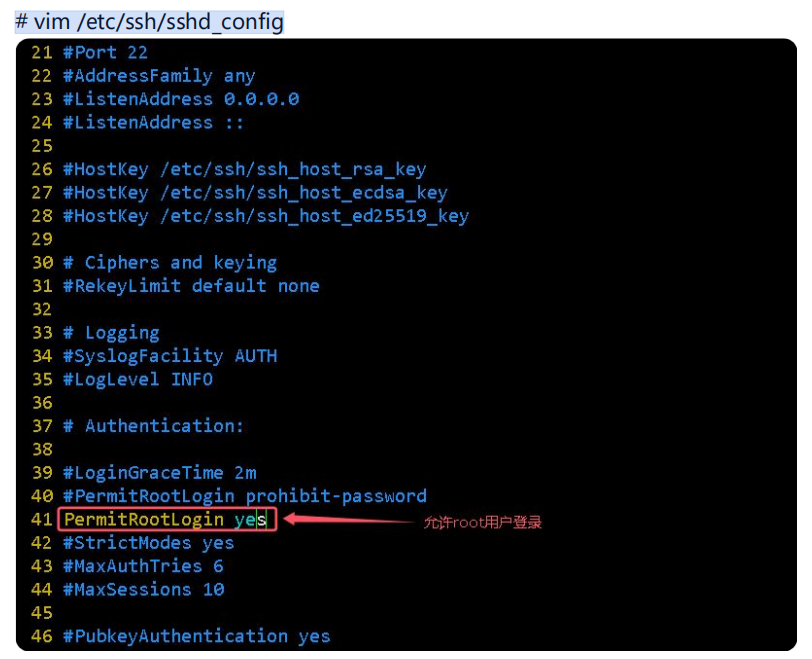

环境准备

**配置静态** **ip**

**进入到网卡配置目录**

\# cd /etc/NetworkManager/system-connections/

**配置网卡**

\# vim ens33.nmconnection


```
[connection]

id=ens33

uuid=68d9b637-d690-3abe-a6a4-a73c06f7953e

type=ethernet

autoconnect-priority=-999

interface-name=ens160

timestamp=1737040847

[ethernet]

[ipv4]

\#method=auto

method=manual

address1=192.168.10.6/24,192.168.10.254

dns=114.114.114.114

[ipv6]

addr-gen-mode=eui64

method=auto

[proxy]
```

主要：

\# method=auto 		动态获取 ip


method=manual 		静态配置 ip

address1=192.168.10.6/24,192.168.10.254 		ip 地址、掩码、网关

dns=114.114.114.114 		公共 DNS 服务器

**重启网络**

\# nmcli connection down en33 ;nmcli connection up ens33

重启网络管理服务

\# systemctl restart NetworkManager

\# ip a

如果**root** **用户无法登录**

如果在安装的时候，禁用了 root 用户，则需要修改 ssh 的配置文件，允许 root 用户登录！

\# vim /etc/ssh/sshd_config



\# systemctl restart sshd

**关闭** **selinux**

\# vim /etc/selinux/config

**注意：关闭后，重启生效，不重启则设置为宽容模式，下次重启后生效**

\# setenforce 0

\# getenforce

\# systemctl status firewalld

实验环境可关闭防火

\# systemctl disable firewalld.service --now

\# systemctl status firewalld


**克隆部署 Zabbix Server 6.4 核心服务器**

**环境说明：**

★ 本次部署，采用：松耦合方式，尽可能独立部署<Zabbix Server 服务器>的各个功能组件，从而方便我们在生产中予以集群化部署。

**角色**	 **IP 地址** 

MySQL 数据库(版本：8.0) 	 192.168.168.16/24 

Nginx + PHP Web 前端	  192.168.168.17/24 

Zabbix Server 核心服务(版本：6.4) 	 192.168.168.18/24 

**安装部署：MySQL 数据库**

\## 安装：MySQL 数据库，并创建<zabbix 用户数据库>

```
dnf install -y mysql-server mysql

systemctl enable mysqld

systemctl restart mysqld

mysqladmin -uroot password 'a123456!'

mysql -uroot -p'a123456!' <<EOF
create database if not exists zabbix character set utf8mb4 collate utf8mb4_bin;
create user if not exists root@'%' identified by 'a123456!';
grant all privileges on *.* to root@'%';
create user if not exists zabbix@localhost identified by 'a123456!';
grant all privileges on zabbix.* to zabbix@localhost;
create user if not exists zabbix@'%' identified by 'a123456!';
grant all privileges on zabbix.* to zabbix@'%';
set global log_bin_trust_function_creators = 1; ## 在<zabbix 用户数据库>导入数据之前，允许：<非特权用户>创建<存储函数>
EOF

firewall-cmd --permanent --add-port=3306/tcp
firewall-cmd --reload
```

firewall-cmd --permanent --add-port=3306/tcp

firewall-cmd --reload

**安装部署：Nginx Web 前端**

禁用：<EPEL 源>中的<Zabbix 软件包>

vim /etc/yum.repos.d/epel.repo         这是：一个国内的 EPEL YUM 镜像源,没有epel源，可以添加这个源

```
[epel]
name=Extra Packages for Enterprise Linux $releasever - $basearch
baseurl=https://mirrors.ustc.edu.cn/epel/$releasever//Everything/$basearch
failovermethod=priority
enabled=1
gpgcheck=0
excludepkgs=zabbix\*
```

(2) 获取：<Zabbix 软件包>的<repo 源配置文件>

```
rpm -Uvh https://repo.zabbix.com/zabbix/6.0/rhel/9/x86_64/zabbix-release-6.0-4.el9.noarch.rpm

yum clean all

yum makecache
```

\# (3) 安装：<Nginx Web 前端>

```
dnf install -y zabbix-web-mysql zabbix-nginx-conf
```

\## (4) 针对<Nginx Web 前端>配置：侦听端口、虚拟主机名称

```
vi /etc/nginx/conf.d/zabbix.conf

......

listen 80;

server_name zabbix.test.cn;

root 

/usr/share/zabbix;

index 

index.php;

......
```


 (5) 配置：<Nginx Web 前端>的<PHP 配置文件>，设置正确的<时区>

vi /etc/php-fpm.d/zabbix.conf

```
[zabbix]

user = nginx

group = nginx

listen = /run/php-fpm/zabbix.sock

listen.acl_users = apache,nginx

listen.allowed_clients = 127.0.0.1

... ...

php_value[date.timezone] = Asia/Shanghai
```


 (6) 授予：<nginx 用户>针对</etc/zabbix/web 目录>具备<写入权限>，因为在<Web 安装向导>中，需要自定生成<配置文件>


setfacl -m u:nginx:rwx /etc/zabbix/web/


 (7) 启动：Nginx 服务进程、php-fpm 服务进程


systemctl enable nginx php-fpm

systemctl restart nginx php-fpm


firewall-cmd --permanent --zone=public --add-port=80/tcp

firewall-cmd --reload

 禁用：SElinux

if ! [[ $(getenforce) == "Disabled" ]]; then

sed -r -i 's/^\s*SELINUX=.*/SELINUX=disabled/' /etc/selinux/config

reboot

fi


(8) 添加：可视化的<中文字体>支持

① win+r 搜索：fonts，从而打开 Windows 的<Fonts 目录>

② 挑选：**simfang.ttf** 字体文件，并将其上传到 /usr/share/zabbix/assets/fonts 目录

③ 挑选：**simfang.ttf** 字体文件，并将其上传到 /usr/share/zabbix/assets/fonts 目录

④ 修改：/usr/share/zabbix/include/defines.inc.php 配置文件


vim /usr/share/zabbix/include/defines.inc.php


```
define('ZBX_GRAPH_FONT_NAME', 'simfang'); 
```


**安装部署：Zabbix Server 核心服务器**

(1) 禁用：EPEL 源中的 Zabbix

\##

vi /etc/yum.repos.d/ustc_epel_9.repo 

\## 这是：一个国内的 EPEL YUM 镜像源

```
[epel]

name=Extra Packages for Enterprise Linux $releasever - $basearch

baseurl=https://mirrors.ustc.edu.cn/epel/$releasever//Everything/$basearch

failovermethod=priority

enabled=1

gpgcheck=0

excludepkgs=zabbix*
```

(2) 获取：<Zabbix 软件包>的<repo 源配置文件>

```
rpm -Uvh https://repo.zabbix.com/zabbix/6.0/rhel/9/x86_64/zabbix-release-6.0-4.el9.noarch.rpm

yum clean all

yum makecache
```

(3) 安装：Zabbix Server 核心服务、Agent 客户端代理


dnf install -y zabbix-server-mysql zabbix-sql-scripts zabbix-selinux-policy zabbix-agent


(4) 针对 MySQL 数据库，导入：初始架构和数据

dnf install -y mysql


zcat /usr/share/zabbix-sql-scripts/mysql/server.sql.gz | mysql --default-character-set=utf8mb4 -uzabbix -p'a123456!' -h 192.168.168.16 zabbix


(5) 在导入数据库架构之后，针对 MySQL 数据库，禁用：log_bin_trust_function_creators 选项。


mysql -uroot -p'a123456!' -h 192.168.168.16 <<EOF

set global log_bin_trust_function_creators = 0; 

use zabbix;

show tables;

EOF


(6) 针对 Zabbix Server 核心服务，配置：数据库连接参数


vi /etc/zabbix/zabbix_server.conf

......

DBHost=192.168.10.16

DBName=zabbix

DBUser=zabbix

DBPassword=123456

6

DBPort=3306

......


cat /etc/zabbix/zabbix_server.conf | grep -vE "^\s*(#|$)"


(7) 启动：Zabbix Server 服务进程、Agent 客户端代理


systemctl enable zabbix-server zabbix-agent

systemctl restart zabbix-server zabbix-agent

firewall-cmd --permanent --zone=public --add-port=10050/tcp 

firewall-cmd --permanent --zone=public --add-port=10051/tcp 

firewall-cmd --reload


 禁用：SElinux

if ! [[ $(getenforce) == "Disabled" ]]; then

sed -r -i 's/^\s*SELINUX=.*/SELINUX=disabled/' /etc/selinux/config

reboot

fi

**http://zabbix.test.cn**

\# 在<Web 安装向导>执行完成之后，需编辑：<Nginx Web 前端>的</etc/zabbix/web/zabbix.conf.php>


明确指定：$ZBX_SERVER = '192.168.168.18'; ## 这是：Zabbix Server 的 IP 地址

$ZBX_SERVER_PORT = '10051'; \## 这是：Zabbix Server 的侦听端口

从而访问：分离式部署的<Zabbix Server 核心服务节点>

否则：将会默认访问<localhost>

vi /etc/zabbix/web/zabbix.conf.php

```
......

$ZBX_SERVER = '192.168.168.18';

$ZBX_SERVER_PORT = '10051';

$ZBX_SERVER_NAME = 'zabbix_server';

......
```

刷新页面

修改：<Zabbix Web 前端>的<Admin 管理员密码>

**查看日志：zabbix-server.log 日志**

cat /var/log/zabbix/zabbix_server.log


### 配置agent

**安装配置：Zabbix Agent 客户端代理（仅在<被监控主机>部署）**

禁用：EPEL 源中的 Zabbix

vim /etc/yum.repos.d/ustc_epel_9.repo  // 这是：一个国内的 EPEL YUM 镜像源

[epel]

name=Extra Packages for Enterprise Linux $releasever - $basearch

baseurl=https://mirrors.ustc.edu.cn/epel/$releasever//Everything/$basearch

failovermethod=priority

enabled=1

gpgcheck=0

**excludepkgs=zabbix\***


 (2) 获取：<Zabbix 软件包>的<repo 源配置文件>

rpm -Uvh https://repo.zabbix.com/zabbix/6.0/rhel/9/x86_64/zabbix-release-6.0-4.el9.noarch.rpm

yum clean all

yum makecache


安装：<Zabbix Agent 客户端代理>

dnf install -y zabbix-agent

vi /etc/zabbix/zabbix_agentd.conf

```
设置：<超时阈值>为<最大值>，从而应对耗时较长的<数据收集>操作

Timeout=30


 针对<被被模式>，设置：<Zabbix Agent 侦听端口>

♦ 功能说明：

♢在<指定端口>侦听<数据采集请求>

ListenPort=10050


针对<被被模式>，设置：<Zabbix Server 核心服务器>的<IP 地址> 或者 <Zabbix Proxy 分布式代理服务器>的<IP 地址>

♦ 功能说明：

♢控制：<本机 Zabbix Agent 程序>在<10050/tcp 端口>上，应该接收谁的<数据采集请求>？

Server=1**92.168.168.18


针对<主动模式>，设置：<Zabbix Server 核心服务器>的<IP 地址> 或者 <Zabbix Proxy 分布式代理服务器>的<IP 地址>

♦ 功能说明：

♢控制：应该向谁主动汇报<采集数据>？

ServerActive=192.168.168.18:10051


针对<自动注册>，设置：唯一性的<主机注册名称>

Hostname=zabbixAgent
```

查看修改结果

cat /etc/zabbix/zabbix_agentd.conf | grep -vE "^\s*(#|$)"

systemctl enable zabbix-agent.service

systemctl restart zabbix-agent.service

systemctl status zabbix-agent.service

防火墙放行

```
firewall-cmd --permanent --zone=public --add-port=10050/tcp 

firewall-cmd --reload
```

关selinux

```
if ! [[ $(getenforce) == "Disabled" ]]; then

sed -r -i 's/^\s*SELINUX=.*/SELINUX=disabled/' /etc/selinux/config

reboot

fi
```


**查看日志：Zabbix Agent 日志**

cat /var/log/zabbix/zabbix_agentd.log 

查看：Zabbix Agent 日志


主动模式：代理客户端主动通过zabbix服务端的10051汇报健康情况，因此服务端需要开启10051端口接收来自代理客户端主动发来的健康检测信息

被动模式：服务端通过代理客户端的10050端口来轮询代理客户端的健康信息，因此需要代理客户端开启10050端口来接受来自服务端的轮询检测


**zabbix_get 命令行 服务端实用程序**

安装：

dnf install -y zabbix-get 		--在<Zabbix Server/Proxy 服务端>安装

zabbix_get -h ## 查看：命令帮助

zabbix_get -V ## 查看：命令版本

例句（查看代理客户端的mac地址）：

zabbix_get -s **192.168.168.19** -k **system.hw.macaddr[ens33]**


添加监控主机

1.直接在web页面上添加

2.Autoregistration 自动注册与监控

**在Zabbix Agent 客户端**

vi /etc/zabbix/**zabbix_agentd.d**/autoActiveRegistration.conf


**ServerActive=**192.168.168.18:10051

**HostnameItem=**system.hostname

**HostMetadata=**ZabbixAgent1 on Linux

**确保：<Zabbix Server 服务端>侦听<10051/tcp 端口>**（默认也是监控10051端口)

自定义监控项

**方法 1：命令法（简单）**

将UnsafeUserParameters的值修改为1，表示开启自定义监控项功能

vi /etc/zabbix/zabbix_agentd.conf

UnsafeUserParameters=1


vi /etc/zabbix/zabbix_agentd.d/myDiyKeys.conf

UserParameter=count.User，who | wc -l


systemctl restart zabbix-agent.service

在<Zabbix Server 服务端>上，执行测试

\##

dnf install -y zabbix-get

\## 获取：tcp 和 udp 连接数

zabbix_get -s **192.168.168.19** -k count.User

**方法 2：脚本法（强大）**

vi /etc/zabbix/zabbix_agentd.d/myShellScript01.sh

```
#/bin/bash

mountDir=$1

df -h $mountDir | awk 'NR>1{print $4}'
```

开启自定义监控项

vi /etc/zabbix/zabbix_agentd.conf

UnsafeUserParameters=1


vi /etc/zabbix/zabbix_agentd.d/myDiyKeys.conf

UserParameter=net.if.connections.sum[*],ss $1 $2 -H | wc -l

 添加如下：

UserParameter=mount.filesystem.size.free[\*],bash /etc/zabbix/zabbix_agentd.d/myShellScript01.sh $1


systemctl restart zabbix-agent.service


第四步：在<Zabbix Server 服务端>上，执行测试

dnf install -y zabbix-get

获取：/挂载点的剩余空间

zabbix_get -s **192.168.10.19** -k **mount.filesystem.size.free[/opt]**